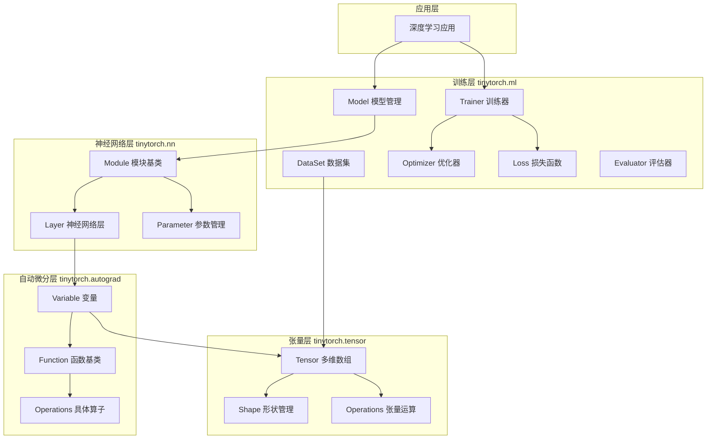
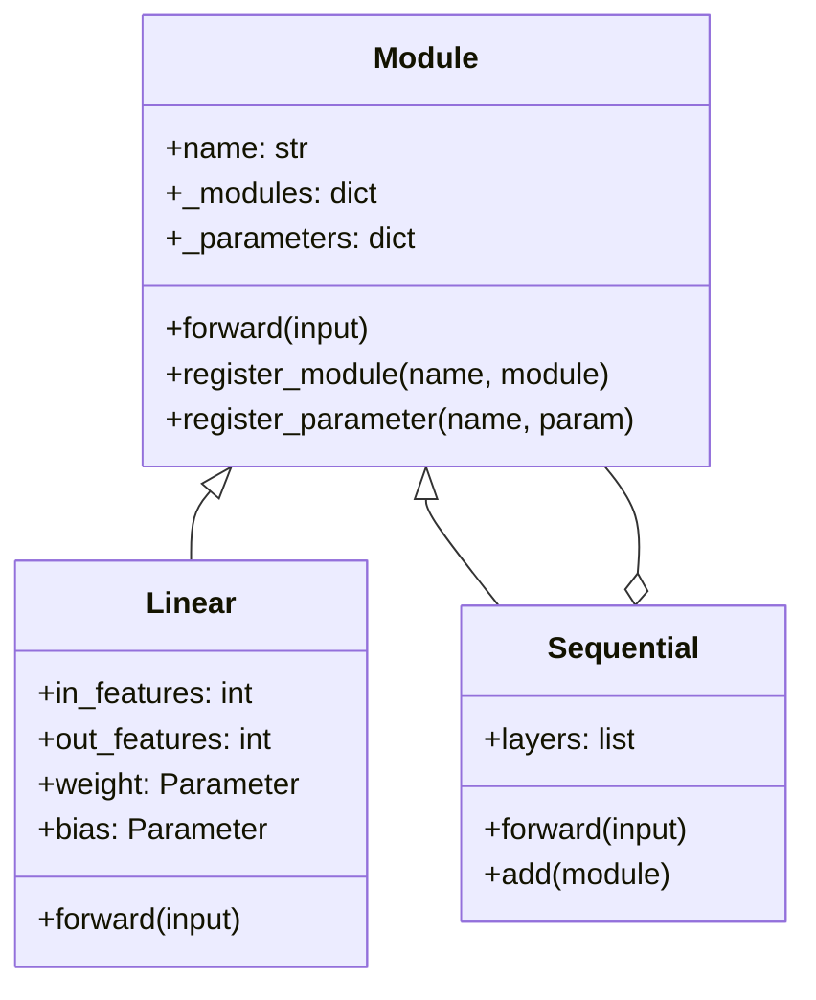
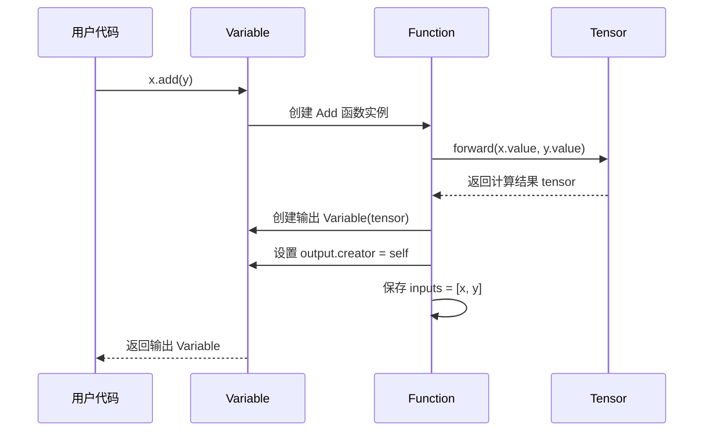
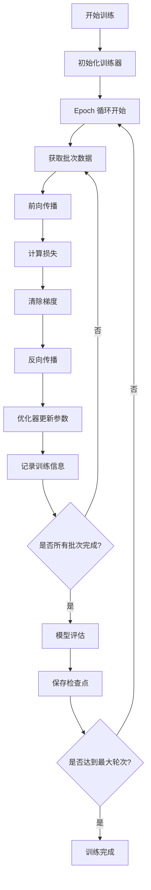
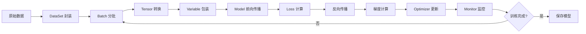
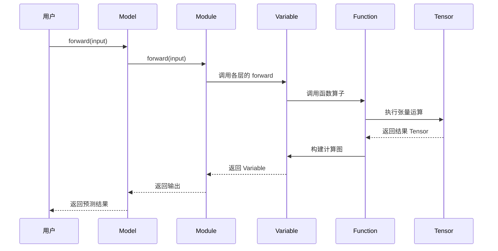
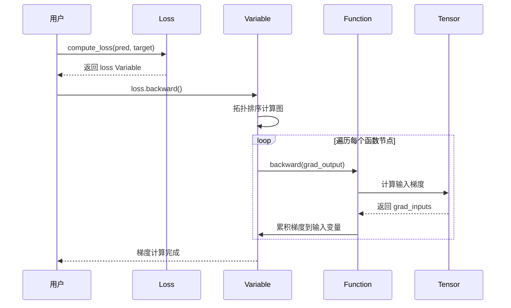

# tinyTorch 轻量级深度学习框架设计文档

## 1. 项目概述

### 1.1 项目背景

基于 TinyAI 项目中 tinyai-deeplearning 模块的成功实践，使用 Python 语言重新实现一个轻量级深度学习框架 tinyTorch。该框架将参考 tinyai-deeplearning 的架构设计和实现方案，但完全使用 Python 语言实现，不依赖任何第三方库（如 numpy、pytorch 等），以保持框架的轻量级特性和教学价值。

### 1.2 设计目标

- **架构对标**：深度参考 tinyai-deeplearning 的分层架构设计理念，实现相同功能的 Python 版本
- **纯 Python 实现**：仅使用 Python 标准库，避免外部依赖，确保代码可读性和可移植性
- **功能完整性**：实现核心深度学习功能，包括多维数组操作、自动微分、神经网络构建、模型训练等
- **教学友好**：代码结构清晰，注释完善，便于学习和理解深度学习框架的底层实现原理

### 1.3 核心价值

- 提供一个完全透明、可控的深度学习框架实现
- 帮助开发者深入理解深度学习框架的底层机制
- 作为 TinyAI 项目的 Python 语言版本参考实现
- 展示跨语言框架设计的一致性和可移植性

## 2. 架构设计

### 2.1 整体架构

tinyTorch 采用与 tinyai-deeplearning 相同的分层架构设计，从底层到上层依次为：



### 2.2 分层职责

#### 2.2.1 张量层（tinytorch.tensor）

**定位**：框架的数值计算基础层，提供多维数组的抽象和基本运算

**核心组件**：
- `Tensor`：多维数组核心类，支持创建、索引、变形、运算等操作
- `Shape`：形状管理类，处理维度信息和形状变换
- `Storage`：数据存储抽象，管理底层一维数组

**主要功能**：
- 多维数组的创建与初始化（零数组、单位矩阵、随机数组等）
- 基础数学运算（加减乘除、矩阵乘法、转置等）
- 形状操作（reshape、transpose、broadcast 等）
- 索引与切片操作
- 归约操作（sum、mean、max、min 等）

#### 2.2.2 自动微分层（tinytorch.autograd）

**定位**：实现自动微分机制，构建动态计算图

**核心组件**：
- `Variable`：自动微分变量，包含值、梯度、计算图信息
- `Function`：函数基类，定义前向传播和反向传播接口
- 具体算子：加法、乘法、激活函数、矩阵运算等

**主要功能**：
- 动态计算图构建
- 前向传播计算
- 反向传播与梯度计算
- 梯度累积与清零
- 计算图的内存管理

#### 2.2.3 神经网络层（tinytorch.nn）

**定位**：提供神经网络构建的基础模块和层

**核心组件**：
- `Module`：所有神经网络层的基类
- `Parameter`：可训练参数的封装
- 具体层实现：Linear、Conv2d、RNN、LSTM、MultiHeadAttention 等

**主要功能**：
- 神经网络层的组合与嵌套
- 参数的注册与管理
- 前向传播接口
- 训练/评估模式切换
- 参数初始化

#### 2.2.4 训练层（tinytorch.ml）

**定位**：提供完整的模型训练、评估和管理功能

**核心组件**：
- `Model`：模型生命周期管理
- `Trainer`：训练流程控制
- `DataSet`：数据集抽象与批处理
- `Optimizer`：参数优化算法（SGD、Adam 等）
- `Loss`：损失函数（MSE、CrossEntropy 等）
- `Evaluator`：模型评估指标

**主要功能**：
- 训练循环管理
- 批次数据处理
- 参数更新
- 损失计算
- 模型评估
- 模型序列化与加载

### 2.3 设计模式应用

#### 2.3.1 组合模式

在神经网络构建中使用组合模式，Module 可以包含多个子 Module，形成层次化的网络结构：



#### 2.3.2 策略模式

优化器、损失函数、评估器等组件使用策略模式，允许运行时灵活切换不同的算法实现：

- 优化器策略：SGD、Adam、RMSprop
- 损失函数策略：MSELoss、CrossEntropyLoss、BCELoss
- 评估器策略：AccuracyEvaluator、F1ScoreEvaluator

#### 2.3.3 观察者模式

训练过程中的监控与回调机制使用观察者模式：

- Trainer 作为主题，在训练的关键节点发出通知
- Monitor、Callback 作为观察者，响应训练事件
- 支持自定义回调函数，实现灵活的训练监控

## 3. 核心模块设计

### 3.1 张量模块（tinytorch.tensor）

#### 3.1.1 Tensor 类设计

**核心属性**：

| 属性名 | 类型 | 说明 |
|--------|------|------|
| data | list | 底层一维数据存储 |
| shape | Shape | 张量形状信息 |
| dtype | str | 数据类型（'float32', 'int32' 等） |
| requires_grad | bool | 是否需要梯度（用于后续自动微分） |

**核心方法**：

| 方法名 | 参数 | 返回值 | 说明 |
|--------|------|--------|------|
| `__init__` | data, shape, dtype | Tensor | 构造函数 |
| zeros | shape | Tensor | 创建全零张量 |
| ones | shape | Tensor | 创建全一张量 |
| randn | shape | Tensor | 创建标准正态分布随机张量 |
| reshape | new_shape | Tensor | 改变张量形状 |
| transpose | axes | Tensor | 转置张量 |
| add | other | Tensor | 张量加法 |
| mul | other | Tensor | 张量乘法 |
| matmul | other | Tensor | 矩阵乘法 |
| sum | axis, keepdims | Tensor | 求和归约 |
| mean | axis, keepdims | Tensor | 求平均值 |

**内存布局**：
采用扁平化行优先（Row-Major）内存布局，所有数据存储在一维列表中，通过 Shape 对象管理多维索引映射。

**广播机制**：
实现类似 NumPy 的广播规则，支持不同形状张量之间的运算：
1. 从最后一个维度开始逐维度比较
2. 维度大小相同或其中一个为 1 时可以广播
3. 缺失的维度视为大小为 1

#### 3.1.2 Shape 类设计

**核心属性**：

| 属性名 | 类型 | 说明 |
|--------|------|------|
| dims | tuple | 各维度大小 |
| ndim | int | 维度数量 |
| size | int | 元素总数 |
| strides | tuple | 各维度步长 |

**核心方法**：

| 方法名 | 参数 | 返回值 | 说明 |
|--------|------|--------|------|
| `__init__` | dims | Shape | 构造函数 |
| from_list | dims_list | Shape | 从列表创建 |
| can_broadcast | other_shape | bool | 判断是否可广播 |
| broadcast_to | target_shape | Shape | 广播到目标形状 |
| compute_strides | dims | tuple | 计算步长信息 |
| linear_index | indices | int | 多维索引转一维索引 |

### 3.2 自动微分模块（tinytorch.autograd）

#### 3.2.1 Variable 类设计

**核心属性**：

| 属性名 | 类型 | 说明 |
|--------|------|------|
| value | Tensor | 变量的值 |
| grad | Tensor | 变量的梯度 |
| creator | Function | 生成该变量的函数 |
| requires_grad | bool | 是否需要计算梯度 |
| name | str | 变量名称（用于调试） |

**核心方法**：

| 方法名 | 参数 | 返回值 | 说明 |
|--------|------|--------|------|
| `__init__` | value, name, requires_grad | Variable | 构造函数 |
| backward | retain_graph | None | 反向传播计算梯度 |
| clear_grad | - | None | 清除梯度 |
| detach | - | Variable | 分离计算图 |
| add | other | Variable | 变量加法 |
| mul | other | Variable | 变量乘法 |
| matmul | other | Variable | 矩阵乘法 |
| relu | - | Variable | ReLU 激活 |
| sigmoid | - | Variable | Sigmoid 激活 |
| reshape | shape | Variable | 改变形状 |

**计算图构建流程**：



**反向传播算法**：

采用拓扑排序的反向传播算法：

1. 从输出变量开始，初始化梯度为 1
2. 构建计算图的拓扑排序序列
3. 按拓扑逆序遍历每个函数节点
4. 调用函数的 backward 方法计算输入梯度
5. 累积梯度到各输入变量

#### 3.2.2 Function 基类设计

**核心属性**：

| 属性名 | 类型 | 说明 |
|--------|------|------|
| inputs | list[Variable] | 输入变量列表 |
| outputs | list[Variable] | 输出变量列表 |
| saved_tensors | list | 前向传播保存的中间结果 |

**核心方法**：

| 方法名 | 参数 | 返回值 | 说明 |
|--------|------|--------|------|
| forward | *inputs | Tensor/list[Tensor] | 前向传播（抽象方法） |
| backward | grad_output | list[Tensor] | 反向传播（抽象方法） |
| call | *inputs | Variable/list[Variable] | 函数调用入口 |
| save_for_backward | *tensors | None | 保存前向传播的中间结果 |

**具体算子实现**：

- **基础运算**：Add、Sub、Mul、Div、Neg
- **数学函数**：Exp、Log、Sqrt、Pow、Abs
- **激活函数**：ReLU、Sigmoid、Tanh、LeakyReLU、GELU
- **矩阵运算**：MatMul、Transpose、Reshape、Concat、Split
- **归约运算**：Sum、Mean、Max、Min
- **损失函数**：MSE、SoftmaxCrossEntropy、BCELoss

### 3.3 神经网络模块（tinytorch.nn）

#### 3.3.1 Module 基类设计

**核心属性**：

| 属性名 | 类型 | 说明 |
|--------|------|------|
| _modules | dict | 子模块字典 |
| _parameters | dict | 参数字典 |
| _buffers | dict | 非可训练缓冲区字典 |
| training | bool | 训练/评估模式标志 |
| name | str | 模块名称 |

**核心方法**：

| 方法名 | 参数 | 返回值 | 说明 |
|--------|------|--------|------|
| forward | *inputs | Variable | 前向传播（抽象方法） |
| register_module | name, module | None | 注册子模块 |
| register_parameter | name, param | None | 注册参数 |
| register_buffer | name, tensor | None | 注册缓冲区 |
| parameters | recursive | list[Parameter] | 获取所有参数 |
| named_parameters | recursive | dict | 获取参数名称和值 |
| train | - | None | 设置为训练模式 |
| eval | - | None | 设置为评估模式 |
| zero_grad | - | None | 清除所有参数梯度 |

#### 3.3.2 Parameter 类设计

**核心属性**：

| 属性名 | 类型 | 说明 |
|--------|------|------|
| data | Tensor | 参数数据 |
| grad | Tensor | 参数梯度 |
| requires_grad | bool | 是否需要梯度（固定为 True） |
| name | str | 参数名称 |

#### 3.3.3 常用层实现

**Linear（全连接层）**：

- **参数**：
  - in_features: 输入特征数
  - out_features: 输出特征数
  - bias: 是否使用偏置
  
- **可训练参数**：
  - weight: 权重矩阵，形状为 (out_features, in_features)
  - bias: 偏置向量，形状为 (out_features,)
  
- **前向传播**：`output = input @ weight.T + bias`

**Conv2d（二维卷积层）**：

- **参数**：
  - in_channels: 输入通道数
  - out_channels: 输出通道数
  - kernel_size: 卷积核大小
  - stride: 步长
  - padding: 填充
  
- **可训练参数**：
  - weight: 卷积核，形状为 (out_channels, in_channels, kernel_h, kernel_w)
  - bias: 偏置，形状为 (out_channels,)

**RNN（循环神经网络层）**：

- **参数**：
  - input_size: 输入特征数
  - hidden_size: 隐藏状态维度
  - num_layers: 层数
  
- **可训练参数**：
  - weight_ih: 输入到隐藏的权重
  - weight_hh: 隐藏到隐藏的权重
  - bias_ih, bias_hh: 偏置

**MultiHeadAttention（多头注意力层）**：

- **参数**：
  - embed_dim: 嵌入维度
  - num_heads: 注意力头数
  - dropout: Dropout 比例
  
- **可训练参数**：
  - q_proj, k_proj, v_proj: Q、K、V 投影权重
  - out_proj: 输出投影权重

**LayerNorm（层归一化）**：

- **参数**：
  - normalized_shape: 归一化的形状
  - eps: 数值稳定性常数
  
- **可训练参数**：
  - weight: 缩放参数 gamma
  - bias: 偏移参数 beta

### 3.4 训练模块（tinytorch.ml）

#### 3.4.1 Model 类设计

**核心属性**：

| 属性名 | 类型 | 说明 |
|--------|------|------|
| name | str | 模型名称 |
| module | Module | 神经网络模块 |
| model_info | ModelInfo | 模型元数据信息 |

**核心方法**：

| 方法名 | 参数 | 返回值 | 说明 |
|--------|------|--------|------|
| `__init__` | name, module | Model | 构造函数 |
| forward | input | Variable | 前向传播 |
| save | file_path | None | 保存模型 |
| load | file_path | Model | 加载模型 |
| save_parameters | file_path | None | 仅保存参数 |
| load_parameters | file_path | None | 加载参数 |
| parameters | - | list[Parameter] | 获取所有参数 |
| train | - | None | 设置训练模式 |
| eval | - | None | 设置评估模式 |

#### 3.4.2 Trainer 类设计

**核心属性**：

| 属性名 | 类型 | 说明 |
|--------|------|------|
| model | Model | 待训练模型 |
| dataset | DataSet | 训练数据集 |
| optimizer | Optimizer | 优化器 |
| loss_fn | Loss | 损失函数 |
| evaluator | Evaluator | 评估器 |
| max_epochs | int | 最大训练轮次 |
| monitor | Monitor | 训练监控器 |

**核心方法**：

| 方法名 | 参数 | 返回值 | 说明 |
|--------|------|--------|------|
| `__init__` | 各种配置参数 | Trainer | 构造函数 |
| train | - | None | 执行训练循环 |
| train_epoch | - | float | 训练一个 epoch |
| evaluate | eval_dataset | dict | 评估模型 |
| validate | - | float | 在验证集上验证 |
| save_checkpoint | file_path | None | 保存训练检查点 |
| load_checkpoint | file_path | None | 加载检查点 |

**训练流程设计**：



#### 3.4.3 DataSet 类设计

**核心属性**：

| 属性名 | 类型 | 说明 |
|--------|------|------|
| data | list | 数据样本列表 |
| labels | list | 标签列表 |
| batch_size | int | 批次大小 |
| shuffle | bool | 是否打乱数据 |

**核心方法**：

| 方法名 | 参数 | 返回值 | 说明 |
|--------|------|--------|------|
| `__init__` | data, labels, batch_size | DataSet | 构造函数 |
| `__len__` | - | int | 数据集大小 |
| `__getitem__` | index | tuple | 获取单个样本 |
| get_batches | - | list[Batch] | 获取所有批次 |
| split | ratio | tuple[DataSet, DataSet] | 分割数据集 |
| shuffle_data | - | None | 打乱数据 |

#### 3.4.4 Optimizer 类设计

**基类方法**：

| 方法名 | 参数 | 返回值 | 说明 |
|--------|------|--------|------|
| step | - | None | 执行一步参数更新 |
| zero_grad | - | None | 清除所有参数梯度 |
| state_dict | - | dict | 获取优化器状态 |
| load_state_dict | state | None | 加载优化器状态 |

**SGD 优化器**：

- **参数**：learning_rate, momentum, weight_decay
- **更新规则**：`param = param - lr * (grad + weight_decay * param)`
- **动量支持**：`velocity = momentum * velocity + grad`

**Adam 优化器**：

- **参数**：learning_rate, beta1, beta2, eps
- **更新规则**：结合一阶和二阶动量的自适应学习率
- **偏置修正**：对动量估计进行偏置修正

#### 3.4.5 Loss 类设计

**MSELoss（均方误差损失）**：

- **计算公式**：`loss = mean((y_pred - y_true)^2)`
- **用途**：回归任务

**CrossEntropyLoss（交叉熵损失）**：

- **计算公式**：`loss = -mean(sum(y_true * log(softmax(y_pred))))`
- **用途**：多分类任务
- **包含 Softmax**：内部自动计算 softmax

**BCELoss（二元交叉熵损失）**：

- **计算公式**：`loss = -mean(y_true * log(y_pred) + (1 - y_true) * log(1 - y_pred))`
- **用途**：二分类任务

#### 3.4.6 Evaluator 类设计

**AccuracyEvaluator（准确率评估器）**：

- **指标**：分类准确率
- **计算**：正确预测数量 / 总样本数量

**PrecisionRecallEvaluator（精确率召回率评估器）**：

- **指标**：Precision、Recall、F1-Score
- **用途**：不平衡数据集的分类评估

**RegressionEvaluator（回归评估器）**：

- **指标**：MAE、MSE、RMSE、R²
- **用途**：回归任务评估

## 4. 目录结构设计

### 4.1 项目目录树

```
tinyTorch/
├── tinytorch/                          # 主包目录
│   ├── __init__.py                     # ✅ 包初始化文件（含版本信息和便捷导入）
│   │
│   ├── tensor/                         # ✅ 张量模块（已完成）
│   │   ├── __init__.py
│   │   ├── tensor.py                   # ✅ Tensor 核心类（完整实现）
│   │   └── shape.py                    # ✅ Shape 形状管理（完整实现）
│   │
│   ├── autograd/                       # ✅ 自动微分模块（已完成）
│   │   ├── __init__.py
│   │   ├── variable.py                 # ✅ Variable 变量类
│   │   ├── function.py                 # ✅ Function 基类
│   │   └── ops/                        # ✅ 具体算子实现
│   │       ├── __init__.py
│   │       ├── basic.py                # ✅ 基础运算（加减乘除、幂运算）
│   │       ├── math_ops.py             # ✅ 数学函数（exp, log, sqrt）
│   │       ├── activation.py           # ✅ 激活函数（relu, sigmoid, tanh）
│   │       ├── matrix.py               # ✅ 矩阵运算（matmul, transpose）
│   │       └── reduce.py               # ✅ 归约运算（sum, mean, max）
│   │
│   ├── nn/                             # ✅ 神经网络模块（已完成）
│   │   ├── __init__.py
│   │   ├── module.py                   # ✅ Module 基类
│   │   ├── parameter.py                # ✅ Parameter 参数类
│   │   ├── layers/                     # ✅ 神经网络层
│   │   │   ├── __init__.py
│   │   │   ├── linear.py               # ✅ 全连接层
│   │   │   ├── conv.py                 # ✅ Conv2d 卷积层
│   │   │   ├── rnn.py                  # ✅ RNN/LSTM/GRU 层（合并实现）
│   │   │   ├── attention.py            # ✅ MultiHeadAttention 注意力层
│   │   │   ├── normalization.py        # ✅ LayerNorm + Embedding 层
│   │   │   └── activation.py           # ✅ 激活层封装（ReLU, Sigmoid, Tanh）
│   │   ├── container.py                # ✅ Sequential 容器
│   │   └── init.py                     # ✅ 参数初始化（kaiming, xavier）
│   │
│   ├── ml/                             # ✅ 机器学习模块（已完成）
│   │   ├── __init__.py
│   │   ├── model.py                    # ✅ Model 模型管理
│   │   ├── trainer.py                  # ✅ Trainer 训练器
│   │   ├── dataset.py                  # ✅ DataSet 数据集
│   │   ├── monitor.py                  # ✅ 训练监控
│   │   ├── optimizers/                 # ✅ 优化器
│   │   │   ├── __init__.py
│   │   │   ├── optimizer.py            # ✅ Optimizer 基类
│   │   │   ├── sgd.py                  # ✅ SGD 优化器
│   │   │   └── adam.py                 # ✅ Adam 优化器
│   │   ├── losses/                     # ✅ 损失函数
│   │   │   ├── __init__.py
│   │   │   ├── loss.py                 # ✅ Loss 基类
│   │   │   ├── mse.py                  # ✅ MSE 损失
│   │   │   └── crossentropy.py         # ✅ CrossEntropy + BCE 损失（合并）
│   │   └── evaluators/                 # ✅ 评估器
│   │       ├── __init__.py
│   │       ├── evaluator.py            # ✅ Evaluator 基类
│   │       └── accuracy.py             # ✅ 准确率评估
│   │
│   └── utils/                          # ✅ 工具模块（基础）
│       └── __init__.py
│
├── tests/                              # ✅ 测试目录
│   ├── __init__.py                     # ✅
│   ├── test_tensor.py                  # ✅ 张量测试（85行）
│   └── test_nn.py                      # ✅ 神经网络测试（62行）
│
├── examples/                           # ✅ 示例目录
│   ├── basic/                          # ✅ 基础示例
│   │   └── quick_test.py               # ✅ 快速测试
│   ├── cnn/                            # ✅ CNN 示例
│   │   └── mnist_classifier.py         # ✅ CNN 图像分类（257行）
│   ├── nlp/                            # ✅ NLP 示例
│   │   └── language_model.py           # ✅ LSTM 语言模型（270行）
│   ├── transformer/                    # ✅ Transformer 示例
│   │   └── simple_transformer.py       # ✅ Transformer 注意力（299行）
│   ├── classification/                 # 📁 预留目录
│   └── regression/                     # 📁 预留目录
│
├── tutorials/                          # ✅ 教程目录（新增）
│   ├── README.md                       # ✅ 教程总览（157行）
│   ├── 01_quickstart.md                # ✅ 快速入门（178行）
│   ├── 02_tensor_operations.md         # ✅ Tensor 操作详解（367行）
│   └── 03_autograd_system.md           # ✅ 自动微分详解（450行）
│
├── docs/                               # ✅ 文档目录
│   ├── architecture.md                 # ✅ 架构设计文档
│   ├── api_reference.md                # ✅ API 参考文档
│   └── 方案.md                         # ✅ 技术方案详解（本文档）
│
├── README.md                           # ✅ 项目说明（221行）
├── requirements.txt                    # ✅ 依赖清单（空，纯Python）
├── setup.py                            # ✅ 安装脚本
├── pyproject.toml                      # ✅ 现代项目配置
├── MANIFEST.in                         # ✅ 打包清单
├── LICENSE                             # ✅ MIT 开源协议
└── .gitignore                          # ✅ Git 忽略配置
```

**完成度说明**：

- ✅ **已完成**：核心功能已实现并测试
- 📁 **预留目录**：目录已创建但内容待补充
- ⚠️ **部分完成**：基础功能完成，高级功能待扩展

**关键变更**：

1. **合并实现**：RNN/LSTM/GRU 合并在 `rnn.py`，CrossEntropy/BCE 合并在 `crossentropy.py`
2. **新增 tutorials/**：独立的教程目录，包含完整的学习文档
3. **简化 utils/**：保留基础结构，高级工具按需扩展
4. **标准化配置**：添加 `pyproject.toml`、`MANIFEST.in`、`LICENSE` 等标准文件

**代码统计**（截至当前）：

- Python 代码文件：40 个
- 代码总行数：约 8000+ 行
- 测试覆盖：基础测试已建立
- 文档完成度：核心教程已完成（3篇，共 995 行）
- 示例代码：3 个完整示例（826 行）

### 4.2 目录组织原则

- **模块化**：每个子模块职责单一，接口清晰
- **层次化**：严格遵循分层架构，底层模块不依赖上层模块
- **可测试**：核心模块都有对应的测试文件
- **文档完善**：提供完整的 API 文档和学习教程
- **示例丰富**：从基础到进阶，覆盖 CNN、RNN、Transformer 等场景
- **标准化**：遵循 Python 项目标准，包含 setup.py、pyproject.toml、LICENSE 等

### 4.3 项目特色

1. **纯 Python 实现**：无任何第三方依赖，所有代码可读可学
2. **完整的自动微分**：实现了动态计算图和反向传播
3. **丰富的神经网络层**：包含 Linear、Conv2d、RNN、LSTM、GRU、MultiHeadAttention
4. **完善的训练框架**：Model、Trainer、Optimizer、Loss、Evaluator 一应俱全
5. **详细的中文教程**：3 篇核心教程，覆盖 Tensor、Autograd、神经网络基础
6. **实战示例代码**：提供 CNN、LSTM、Transformer 的完整实现示例

## 5. 数据流与计算流程

### 5.1 训练数据流



### 5.2 前向传播流程



### 5.3 反向传播流程



## 6. 技术实现要点

### 6.1 纯 Python 实现策略

#### 6.1.1 数据存储

使用 Python 内置的 list 作为底层数据存储：

- **优点**：无需外部依赖，兼容性好
- **缺点**：性能低于 numpy 的 ndarray
- **优化**：采用一维扁平化存储，减少嵌套列表开销

#### 6.1.2 数学运算

所有数学运算基于 Python 标准库实现：

- **基础运算**：使用 Python 的 `+`, `-`, `*`, `/` 运算符
- **数学函数**：使用 `math` 模块的函数（exp, log, sqrt, sin, cos 等）
- **矩阵乘法**：手动实现三重循环或改进的分块算法
- **随机数**：使用 `random` 模块生成随机数

#### 6.1.3 性能优化

在纯 Python 约束下的性能优化策略：

- **向量化思想**：尽量使用列表推导式和生成器表达式
- **减少内存分配**：复用 Tensor 对象，避免频繁创建销毁
- **计算图剪枝**：及时释放不再需要的中间变量
- **懒惰求值**：延迟计算，只在需要时执行

### 6.2 自动微分实现

#### 6.2.1 动态计算图

- **构建时机**：前向传播时动态构建
- **节点类型**：Variable（变量节点）和 Function（函数节点）
- **边的表示**：Function 保存 inputs 和 outputs 引用
- **图的存储**：隐式存储在 Variable 的 creator 属性中

#### 6.2.2 梯度计算

- **初始化**：输出变量的梯度初始化为 1
- **链式法则**：`dL/dx = dL/dy * dy/dx`
- **梯度累积**：多个路径的梯度需要累加
- **广播处理**：梯度需要按广播规则反向求和

#### 6.2.3 内存管理

- **计算图清理**：提供 `unchain_backward()` 方法释放计算图
- **梯度清零**：训练前调用 `zero_grad()` 清除旧梯度
- **分离操作**：提供 `detach()` 方法创建不需要梯度的副本

### 6.3 神经网络实现

#### 6.3.1 参数初始化

- **Xavier 初始化**：`std = sqrt(2 / (fan_in + fan_out))`
- **He 初始化**：`std = sqrt(2 / fan_in)`
- **正态分布初始化**：`weight ~ N(0, std^2)`
- **均匀分布初始化**：`weight ~ U(-bound, bound)`

#### 6.3.2 层的实现

每个层继承 Module 基类，实现 forward 方法：

- **注册参数**：在 `__init__` 中通过 `register_parameter` 注册
- **前向传播**：在 `forward` 中定义计算逻辑
- **训练模式**：根据 `self.training` 控制 Dropout、BatchNorm 等行为

#### 6.3.3 模型序列化

- **保存格式**：使用 Python 的 pickle 模块
- **保存内容**：
  - 模型结构信息
  - 参数的名称和值
  - 优化器状态（可选）
  - 训练元数据（可选）
- **版本兼容**：记录框架版本号，支持向后兼容

### 6.4 训练流程实现

#### 6.4.1 批次处理

- **数据打乱**：每个 epoch 开始时使用 `random.shuffle`
- **批次划分**：将数据集按 batch_size 划分
- **批次迭代**：提供迭代器接口，逐批返回数据

#### 6.4.2 优化器实现

- **参数注册**：优化器持有模型参数的引用
- **梯度更新**：遍历所有参数，根据梯度更新参数值
- **状态管理**：对于 Adam 等优化器，维护动量等状态
- **学习率调度**：支持固定学习率和动态调整

#### 6.4.3 训练监控

- **实时记录**：每个 batch 或 epoch 记录损失、准确率等指标
- **进度显示**：打印训练进度和预估剩余时间
- **可视化**：生成损失曲线、准确率曲线等图表
- **日志保存**：将训练日志保存到文件

## 7. 与 tinyai-deeplearning 的对应关系

### 7.1 模块映射表

| tinyai-deeplearning（Java） | tinyTorch（Python） | 功能对应 |
|---------------------------|---------------------|---------|
| tinyai-deeplearning-ndarr | tinytorch.tensor | 多维数组操作 |
| tinyai-deeplearning-func | tinytorch.autograd | 自动微分引擎 |
| tinyai-deeplearning-nnet | tinytorch.nn | 神经网络层 |
| tinyai-deeplearning-ml | tinytorch.ml | 机器学习训练 |
| NdArray | Tensor | 多维数组核心类 |
| Shape | Shape | 形状管理 |
| Variable | Variable | 自动微分变量 |
| Function | Function | 函数基类 |
| Module (v2) | Module | 神经网络模块基类 |
| Parameter | Parameter | 可训练参数 |
| Model | Model | 模型管理 |
| Trainer | Trainer | 训练器 |
| Optimizer | Optimizer | 优化器基类 |
| Loss | Loss | 损失函数基类 |
| DataSet | DataSet | 数据集 |
| Evaluator | Evaluator | 评估器 |

### 7.2 设计理念一致性

| 设计理念 | tinyai-deeplearning | tinyTorch |
|---------|-------------------|----------|
| 分层架构 | ✓ | ✓ |
| 组合模式 | ✓（Module/Layer/Block） | ✓（Module 嵌套） |
| 策略模式 | ✓（Optimizer/Loss） | ✓（Optimizer/Loss） |
| 动态计算图 | ✓ | ✓ |
| 参数管理 | ✓（namedParameters） | ✓（named_parameters） |
| 模型序列化 | ✓（ModelSerializer） | ✓（pickle） |
| 训练监控 | ✓（Monitor） | ✓（Monitor） |

### 7.3 API 风格对比

**创建张量/数组**：

```java
// Java - tinyai-deeplearning
NdArray a = NdArray.of(new float[][]{{1, 2}, {3, 4}});
NdArray b = NdArray.zeros(Shape.of(2, 3));
```

```python
# Python - tinyTorch
a = Tensor([[1, 2], [3, 4]])
b = Tensor.zeros((2, 3))
```

**自动微分**：

```java
// Java
Variable x = new Variable(ndArray, "x");
Variable y = x.add(new Variable(1.0));
y.backward();
NdArray grad = x.getGrad();
```

```python
# Python
x = Variable(tensor, name="x")
y = x + 1.0
y.backward()
grad = x.grad
```

**构建神经网络**：

```java
// Java
Module module = new Sequential("model")
    .add(new Linear("fc1", 784, 256))
    .add(new ReLU("relu1"))
    .add(new Linear("fc2", 256, 10));
```

```python
# Python
module = Sequential(
    Linear(784, 256),
    ReLU(),
    Linear(256, 10)
)
```

**模型训练**：

```java
// Java
Trainer trainer = Trainer.builder()
    .model(model)
    .dataSet(dataSet)
    .loss(loss)
    .optimizer(optimizer)
    .epochs(100)
    .build();
trainer.train();
```

```python
# Python
trainer = Trainer(
    model=model,
    dataset=dataset,
    loss=loss,
    optimizer=optimizer,
    max_epochs=100
)
trainer.train()
```

## 8. 测试策略

### 8.1 单元测试

#### 8.1.1 张量模块测试

- **创建测试**：测试各种创建方法（zeros, ones, randn 等）
- **形状测试**：测试 reshape, transpose 等形状操作
- **运算测试**：测试加减乘除、矩阵乘法等运算
- **广播测试**：测试不同形状张量的广播运算
- **边界测试**：测试空张量、标量等边界情况

#### 8.1.2 自动微分测试

- **梯度计算测试**：对比数值梯度和自动微分梯度
- **链式法则测试**：测试复杂计算图的梯度传播
- **计算图测试**：测试计算图的构建和释放
- **特殊操作测试**：测试 detach, no_grad 等操作

#### 8.1.3 神经网络测试

- **层测试**：测试每个层的前向传播和反向传播
- **参数测试**：测试参数注册、获取、更新
- **初始化测试**：测试各种参数初始化方法
- **模式切换测试**：测试 train/eval 模式切换

#### 8.1.4 训练模块测试

- **数据集测试**：测试数据加载、分批、打乱
- **优化器测试**：测试各种优化器的参数更新
- **损失函数测试**：测试损失计算的正确性
- **训练流程测试**：测试完整的训练循环

### 8.2 集成测试

#### 8.2.1 端到端测试

- **MLP 分类**：在简单数据集上训练 MLP 并验证收敛
- **线性回归**：测试简单线性回归任务
- **XOR 问题**：测试非线性问题求解能力

#### 8.2.2 性能测试

- **速度测试**：测量前向传播和反向传播的耗时
- **内存测试**：监控训练过程的内存使用
- **扩展性测试**：测试不同模型规模下的表现

### 8.3 正确性验证

#### 8.3.1 梯度检查

使用数值梯度验证自动微分的正确性：

- **数值梯度**：`(f(x+h) - f(x-h)) / (2*h)`
- **自动梯度**：使用反向传播计算
- **误差容限**：相对误差 < 1e-5

#### 8.3.2 对比验证

与 PyTorch 的结果对比：

- 相同输入，对比输出是否一致
- 相同网络结构，对比梯度是否一致
- 相同训练过程，对比损失曲线是否相似

## 9. 文档规范

### 9.1 代码注释规范

#### 9.1.1 模块级注释

每个模块文件开头包含：

- 模块功能描述
- 作者信息
- 版本信息
- 主要类和函数列表

#### 9.1.2 类级注释

每个类包含：

- 类的功能描述
- 核心属性说明
- 使用示例
- 注意事项

#### 9.1.3 方法级注释

每个公开方法包含：

- 功能简述
- 参数说明（类型、含义、默认值）
- 返回值说明
- 异常说明
- 使用示例

#### 9.1.4 注释风格

使用 Google 风格的 Docstring：

```python
def forward(self, input: Variable) -> Variable:
    """执行前向传播计算。
    
    Args:
        input: 输入变量，形状为 (batch_size, in_features)
        
    Returns:
        输出变量，形状为 (batch_size, out_features)
        
    Raises:
        ValueError: 当输入形状不匹配时抛出
        
    Example:
        >>> layer = Linear(10, 5)
        >>> x = Variable(Tensor.randn((32, 10)))
        >>> y = layer.forward(x)
        >>> print(y.shape)
        (32, 5)
    """
```

### 9.2 用户文档

#### 9.2.1 快速开始

- 安装说明
- 5 分钟入门示例
- 常见问题解答

#### 9.2.2 教程文档

- 张量操作指南
- 自动微分原理与使用
- 构建神经网络
- 模型训练与评估
- 高级特性

#### 9.2.3 API 参考

- 按模块组织的完整 API 文档
- 每个类和方法的详细说明
- 参数说明和示例代码

### 9.3 设计文档

- 架构设计文档（本文档）
- 设计模式说明
- 性能优化策略
- 扩展开发指南

## 10. 开发计划与里程碑

### 10.1 阶段划分

#### 阶段一：基础层实现（张量 + 自动微分）

**目标**：实现 tinytorch.tensor 和 tinytorch.autograd 模块

**任务清单**：
- 实现 Tensor 类及基础操作
- 实现 Shape 类及形状管理
- 实现广播机制
- 实现 Variable 类
- 实现 Function 基类
- 实现基础算子（加减乘除、数学函数、矩阵运算）
- 实现反向传播算法
- 编写单元测试
- 梯度检查验证

**验收标准**：
- 所有单元测试通过
- 梯度检查误差 < 1e-5
- 能够完成简单的自动微分计算

#### 阶段二：神经网络层实现

**目标**：实现 tinytorch.nn 模块

**任务清单**：
- 实现 Module 基类
- 实现 Parameter 类
- 实现 Linear 层
- 实现激活层（ReLU, Sigmoid, Tanh 等）
- 实现 LayerNorm
- 实现 Dropout
- 实现 Embedding
- 实现 Sequential 容器
- 实现参数初始化方法
- 编写单元测试

**验收标准**：
- 所有层的前向传播和反向传播正确
- 参数注册和获取功能正常
- 能够构建多层神经网络

#### 阶段三：训练框架实现

**目标**：实现 tinytorch.ml 模块

**任务清单**：
- 实现 Model 类
- 实现 DataSet 类
- 实现 Optimizer 基类及 SGD
- 实现 Loss 基类及 MSELoss
- 实现 Trainer 类
- 实现 Evaluator 基类及 AccuracyEvaluator
- 实现 Monitor 类
- 实现模型序列化
- 编写单元测试

**验收标准**：
- 能够完成完整的训练流程
- 在简单数据集上验证收敛
- 模型保存和加载功能正常

#### 阶段四：高级功能实现

**目标**：实现高级神经网络层和优化器

**任务清单**：
- 实现 Conv2d 层
- 实现 RNN、LSTM、GRU 层
- 实现 MultiHeadAttention 层
- 实现 Adam 优化器
- 实现 CrossEntropyLoss
- 实现更多评估指标
- 编写集成测试

**验收标准**：
- 高级层的功能正确
- 能够训练 CNN、RNN 等复杂模型
- 集成测试全部通过

#### 阶段五：文档与示例

**目标**：完善文档和示例代码

**任务清单**：
- 编写 API 参考文档
- 编写教程文档
- 编写示例代码（MLP、CNN、RNN 等）
- 编写快速开始指南
- 编写设计模式说明
- 代码注释完善

**验收标准**：
- 文档覆盖所有公开 API
- 示例代码可运行且结果正确
- 新用户能够通过文档快速上手

### 10.2 时间估算

| 阶段 | 预计工作量 | 说明 |
|------|----------|------|
| 阶段一 | 2-3 周 | 核心基础，需要精心设计 |
| 阶段二 | 1-2 周 | 在阶段一基础上相对简单 |
| 阶段三 | 1-2 周 | 训练流程相对标准化 |
| 阶段四 | 2-3 周 | 高级功能实现和调试 |
| 阶段五 | 1 周 | 文档和示例编写 |
| **总计** | **7-11 周** | 根据实际进度调整 |

### 10.3 风险与应对

| 风险 | 影响 | 应对措施 |
|------|------|---------|
| 性能问题 | 中 | 采用向量化思想优化，接受纯 Python 的性能限制 |
| 梯度计算错误 | 高 | 使用数值梯度检查，与 PyTorch 对比验证 |
| 内存泄漏 | 中 | 实现计算图清理机制，及时释放不需要的变量 |
| API 设计不合理 | 中 | 参考 PyTorch API，保持一致性 |
| 测试覆盖不足 | 中 | 每个模块开发完成后立即编写测试 |

## 11. 扩展性设计

### 11.1 硬件加速预留

虽然初期仅实现 CPU 版本，但预留硬件加速接口：

- Tensor 类设计为设备无关的抽象
- 预留 device 参数（'cpu', 'cuda', 'tpu'）
- 运算操作通过后端分发实现
- 为未来集成 C 扩展或 CuPy 留出空间

### 11.2 自定义层支持

提供清晰的自定义层开发指南：

- 继承 Module 基类
- 实现 forward 方法
- 注册参数和子模块
- 示例：自定义注意力层、自定义激活函数

### 11.3 模型导出

预留模型导出接口：

- 导出为 ONNX 格式（通过转换工具）
- 导出为 TensorFlow SavedModel
- 导出为 TorchScript

### 11.4 分布式训练

为未来的分布式训练预留接口：

- 数据并行（Data Parallel）
- 模型并行（Model Parallel）
- 梯度聚合机制
- 多进程/多线程支持

## 12. 质量保证

### 12.1 代码质量

- **代码规范**：遵循 PEP 8 Python 代码风格
- **类型注解**：使用 Type Hints 提高代码可读性
- **代码审查**：关键模块进行 Code Review
- **静态检查**：使用 pylint、mypy 等工具

### 12.2 测试覆盖

- **单元测试覆盖率**：目标 > 80%
- **集成测试**：覆盖主要使用场景
- **回归测试**：确保新功能不影响旧功能
- **性能测试**：监控性能退化

### 12.3 持续集成

- **自动化测试**：每次提交自动运行测试
- **代码质量检查**：自动检查代码风格和类型
- **文档生成**：自动生成 API 文档
- **性能基准**：定期运行性能基准测试

## 13. 设计约束

### 13.1 技术约束

- **语言限制**：仅使用 Python 3.7+
- **依赖限制**：不使用第三方数值计算库（numpy、scipy 等）
- **标准库**：仅使用 Python 标准库（math, random, pickle 等）
- **性能权衡**：接受纯 Python 的性能限制，优先保证正确性和可读性

### 13.2 功能约束

- **初期功能**：聚焦核心深度学习功能，暂不支持高级特性（分布式、量化等）
- **模型规模**：适合小到中等规模的模型训练
- **数据规模**：适合中小规模数据集（如 MNIST、CIFAR-10）

### 13.3 兼容性约束

- **Python 版本**：支持 Python 3.7 及以上
- **操作系统**：跨平台支持（Windows、Linux、macOS）
- **架构对齐**：与 tinyai-deeplearning 保持架构一致性

## 14. 成功标准

### 14.1 功能完整性

- 实现所有核心模块（tensor、autograd、nn、ml）
- 支持常见神经网络层（Linear、Conv、RNN、Attention）
- 支持常见优化器（SGD、Adam）
- 支持常见损失函数（MSE、CrossEntropy）
- 提供完整的训练和评估流程

### 14.2 正确性验证

- 所有单元测试通过
- 梯度检查误差 < 1e-5
- 能够在标准数据集上收敛（MNIST、XOR 等）
- 与 PyTorch 的结果对比一致

### 14.3 可用性

- 提供完整的 API 文档
- 提供多个示例代码
- 代码注释清晰完善
- 新用户能够在 30 分钟内上手

### 14.4 教学价值

- 代码结构清晰，便于阅读和学习
- 注释详细，解释关键设计决策
- 提供设计模式说明和最佳实践
- 能够帮助用户理解深度学习框架的底层实现

### 14.5 性能基准

- 前向传播速度：在 MLP 上能够达到 PyTorch CPU 版本的 10%-30%
- 反向传播速度：在 MLP 上能够达到 PyTorch CPU 版本的 10%-30%
- 内存占用：在相同模型下，内存占用不超过 PyTorch 的 2 倍

## 15. 总结

tinyTorch 作为 TinyAI 项目的 Python 版本实现，将深度参考 tinyai-deeplearning 的成功设计经验，使用纯 Python 语言实现一个轻量级、教学友好的深度学习框架。通过分层架构、模块化设计、丰富的文档和示例，tinyTorch 将为开发者提供一个完全透明、可控的深度学习框架实现，帮助深入理解深度学习的底层机制。

本设计文档明确了项目的目标、架构、模块设计、实现要点、测试策略和开发计划，为后续的开发工作提供了清晰的指导。在开发过程中，应严格遵循本设计文档的规范，确保项目的质量和一致性。
