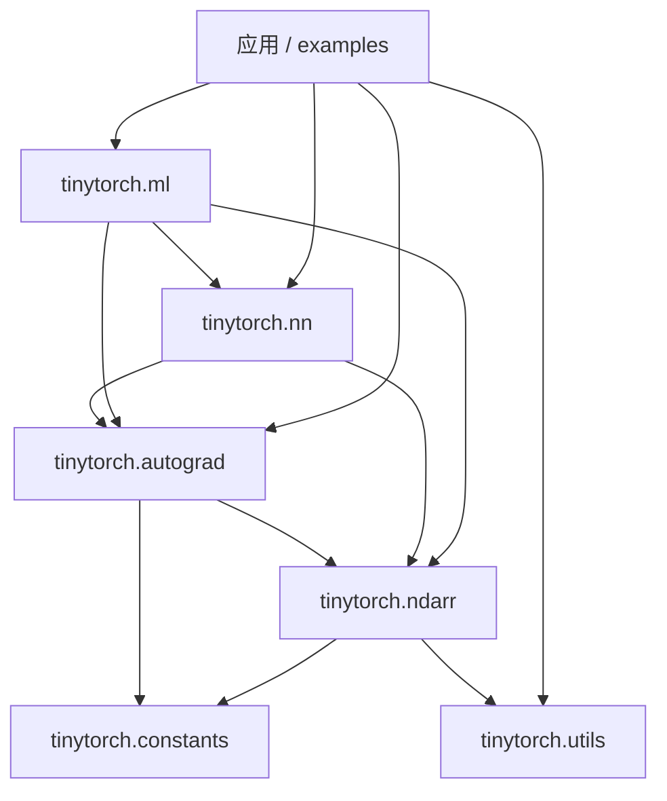
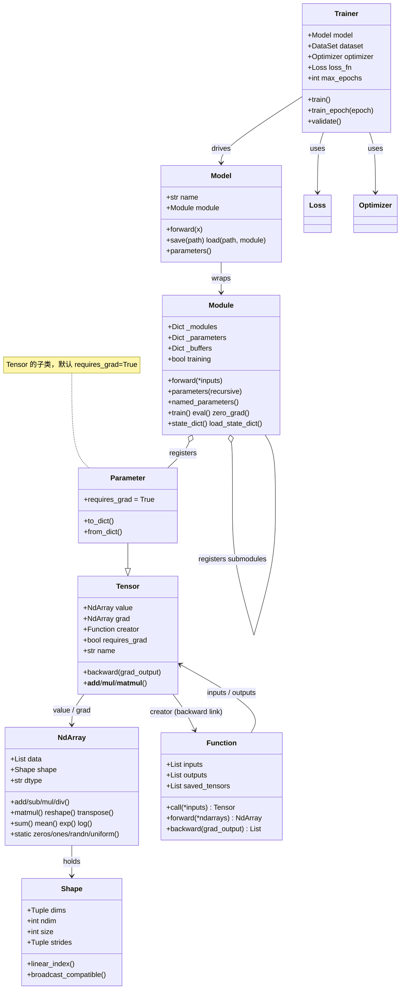
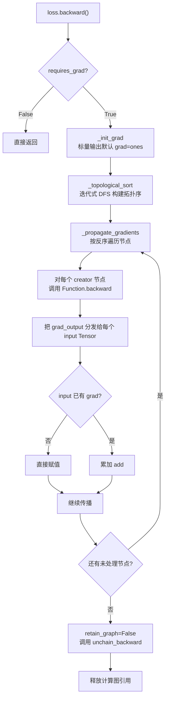
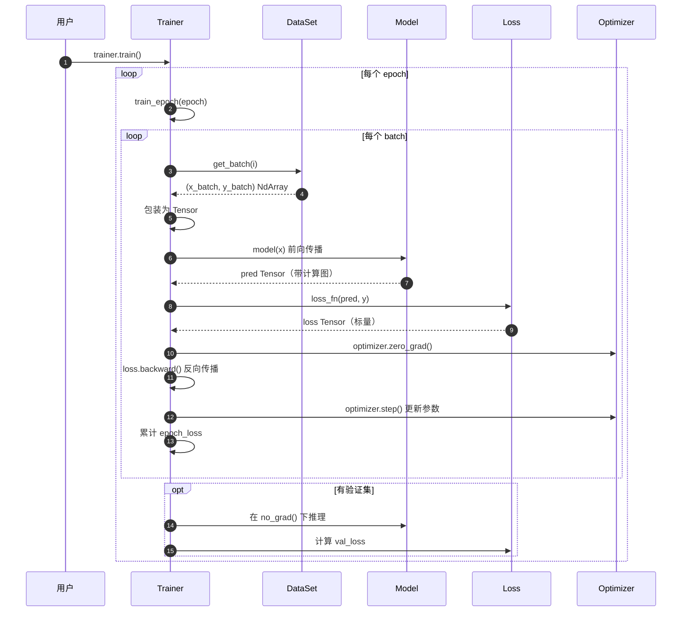
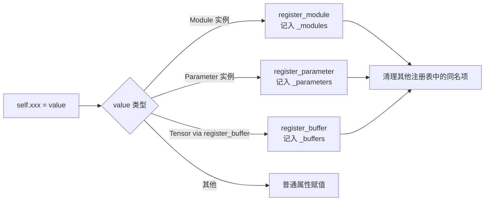

# 03 · 架构设计

本文档从"分层架构 → 模块依赖 → 前向/反向数据流 → 训练循环 → 关键扩展点"五个维度，带你快速建立对 tinyTorch 整体架构的心智模型。

## 3.1 分层架构

tinyTorch 采用**严格自底向上**的分层架构，上层只依赖下层，下层完全不感知上层存在：

```text
┌────────────────────────────────────────────────────────────────────┐
│  L5  应用层                                                         │
│      examples/  +  用户训练脚本                                     │
├────────────────────────────────────────────────────────────────────┤
│  L4  训练编排层                                                     │
│      tinytorch.ml                                                  │
│      ├─ Model           ← 参数管理 / 保存加载                       │
│      ├─ Trainer         ← 训练循环控制器                            │
│      ├─ DataSet         ← 旧版数据接口（简单批处理）                │
│      ├─ optimizers/     ← SGD / Adam                               │
│      ├─ losses/         ← MSE / CrossEntropy / BCE                 │
│      ├─ evaluators/     ← Accuracy / PrecisionRecall / Regression  │
│      ├─ Monitor / EarlyStopping                                    │
│      └─ TrainingVisualizer  ← 训练过程可视化（HTML）                │
├────────────────────────────────────────────────────────────────────┤
│  L3  神经网络层                                                     │
│      tinytorch.nn                                                  │
│      ├─ Module          ← 层/模型基类，注册参数与子模块             │
│      ├─ Parameter       ← Tensor 子类，requires_grad=True          │
│      ├─ Sequential / ModuleList  ← 容器                            │
│      ├─ init            ← 参数初始化（xavier/kaiming/…）            │
│      └─ layers/         ← Linear/Conv2d/RNN/LSTM/GRU/Attention…    │
├────────────────────────────────────────────────────────────────────┤
│  L2  自动微分层                                                     │
│      tinytorch.autograd                                            │
│      ├─ Tensor          ← 计算图节点，保存 value / grad / creator  │
│      ├─ Function        ← 可微分算子基类（forward / backward）      │
│      ├─ no_grad()       ← 禁用梯度追踪的上下文管理器                │
│      ├─ ops/            ← 所有内置算子实现（basic/math/matrix/…）  │
│      └─ graph_viz       ← 计算图可视化（HTML / 提取结构）           │
├────────────────────────────────────────────────────────────────────┤
│  L1  数值内核层                                                     │
│      tinytorch.ndarr                                               │
│      ├─ NdArray         ← 扁平列表存储、行优先布局                  │
│      └─ Shape           ← 维度/步长/广播兼容判断                    │
└────────────────────────────────────────────────────────────────────┘

                       ┌──────────────────────────┐
              横切层    │  tinytorch.utils         │
                       │   ├─ data                │
                       │   │   ├─ Dataset         │
                       │   │   ├─ IterableDataset │
                       │   │   ├─ Sampler 系列    │
                       │   │   ├─ DataLoader      │
                       │   │   └─ default_collate │
                       │   └─ random              │
                       │       （统一随机数入口）  │
                       └──────────────────────────┘

                       ┌──────────────────────────┐
              常量层    │  tinytorch.constants     │
                       │   DEFAULT_EPSILON        │
                       │   EXP_OVERFLOW_THRESHOLD │
                       │   EXP_UNDERFLOW_THRESHOLD│
                       │   BOX_MULLER_MIN_U1      │
                       └──────────────────────────┘
```

> 说明：`utils` 与 `constants` 是被 L1 ~ L4 跨层引用的**横切工具**，不属于任何一层。比如 `ndarr.ndarray` 里的 `NdArray.randn()` 就依赖 `tinytorch.utils.random`。

## 3.2 模块依赖关系

用 Mermaid 依赖图表示（下层被上层依赖，箭头表示 "依赖"）：



关键约束：

- **`ndarr` 不依赖 `autograd` / `nn` / `ml`**，因此可以单独作为数值库使用。
- **`autograd` 不依赖 `nn` / `ml`**，因此可以脱离神经网络层单独用于任意可微计算。
- **`nn` 不依赖 `ml`**，因此可以只用 `nn` 构建模型，手动写训练循环。
- 循环导入通过 `TYPE_CHECKING` + **函数内局部 import** 的方式规避（如 `Function.call()` 内部才导入 `Tensor`）。

## 3.3 核心对象关系



## 3.4 前向传播数据流

以 `y = Linear(x)` 这种最简形式为例，演示一次前向传播中各层的协作：

```text
用户代码                  nn 层                 autograd 层          ndarr 层
───────────────────────────────────────────────────────────────────────────────
x = Tensor(NdArray(...))   ─┐
                            │
y = linear(x)  ────────────►│
   (Module.__call__)        │
                            ▼
                          Linear.forward(x)
                            │
                            │  x.matmul(W.transpose()) + b
                            ▼
                       Tensor.__matmul__(self, other)
                            │
                            ▼
                        MatMul().call(a, b)     （Function.call）
                            │
                            │ 1. 记录 inputs = [a, b]
                            │ 2. requires_grad = 任一输入为 True
                            │ 3. 调用 forward(a.value, b.value)
                            ▼
                       MatMul.forward(a_nd, b_nd)
                            │
                            ▼                      a_nd.matmul(b_nd)
                            │                        │
                            │                        ▼
                            │                 新的 NdArray(结果)
                            │◄──────────────────────┘
                            │
                            │ 4. 包装为 Tensor 并设置 creator = self
                            ▼
                       返回新的 Tensor（作为 y）
```

关键点：

1. `Tensor` 本身不知道怎么做矩阵乘法；所有运算都**代理**给 `Function` 子类（如 `MatMul`）。
2. `Function.call()` 负责**记录计算图**：把输入/输出 Tensor、以及 Function 实例自身串联起来。
3. 真正的数值运算交给 `NdArray` 完成，`Function.forward()` 操作的是 `NdArray` 而不是 `Tensor`。

## 3.5 反向传播流程

以 `loss.backward()` 为例：



实现位于 `tinytorch/autograd/tensor.py` 的 `Tensor.backward()` 内，关键设计：

- **迭代式拓扑排序**：用显式栈避免递归深度过深（`_UNVISITED / _IN_PROGRESS / _DONE` 三状态染色）。
- **梯度累加**：若同一个 `Tensor` 被多条路径引用，梯度会**自动累加**。
- **标量自动填充**：`loss.backward()` 对标量输出自动填 `grad = ones(shape)`。
- **非标量必须显式 grad**：否则会抛 `ValueError`。

## 3.6 训练循环的完整数据流

用 `Trainer.train()` 作为高层编排，展示一次 epoch 的完整流程：



**实现细节定位**：

| 步骤 | 源码位置 |
|------|----------|
| 批次取数据 | `tinytorch/ml/dataset.py` 中的 `DataSet.__iter__` |
| 前向 + 构图 | `tinytorch/autograd/function.py::Function.call` |
| 反向传播 | `tinytorch/autograd/tensor.py::Tensor.backward` |
| 梯度清零 | `tinytorch/ml/optimizers/optimizer.py::Optimizer.zero_grad` |
| 参数更新 | `tinytorch/ml/optimizers/sgd.py::SGD.step` / `adam.py::Adam.step` |
| `no_grad()` 上下文 | `tinytorch/autograd/tensor.py::no_grad` |

## 3.7 Module 的参数/子模块注册机制

`nn.Module` 使用 Python `__setattr__` 魔术方法实现"赋值即注册"，这是理解整个 `nn` 层行为的关键：

```python
class MyNet(Module):
    def __init__(self):
        super().__init__()
        self.fc1 = Linear(10, 20)          # 自动注册到 _modules['fc1']
        self.weight = Parameter(...)       # 自动注册到 _parameters['weight']
        self.register_buffer('running_mean', Tensor(...))  # 显式注册 buffer
```

`Module.__setattr__` 的注册流程：



带来的副作用：

- `model.parameters()` 能**递归**收集整棵模块树的全部 `Parameter`，无需手工维护列表。
- `model.state_dict()` / `load_state_dict()` 也基于这套注册表工作。
- 修改属性名会触发重新注册；把同名属性改赋值为另一种类型时，原注册表里的条目会被自动清理。

## 3.8 计算图生命周期

```text
前向时                           backward() 后（默认）
─────────────────                ──────────────────────

  x ─────┐                          x ─────┐
         ▼                                 ▼
      MatMul        执行完毕，              MatMul
     (creator)      unchain_backward()    (creator = None)
         ▼           被调用                  ▼
         y                                   y  ← 孤立节点
                                             │
                                      grad 保留在 x/y 上
```

- `Tensor.backward()` 默认 `retain_graph=False`，反传结束后会**主动清理 creator 引用**，让 GC 尽早回收 `Function` 实例和中间张量，避免内存泄漏。
- 若需要多次对同一计算图 `backward`（如高阶微分、双塔网络），需显式传 `retain_graph=True`。

## 3.9 关键扩展点

### 3.9.1 新增一个算子（Function）

```python
from tinytorch.autograd.function import Function
from tinytorch.ndarr import NdArray

class MyOp(Function):
    def forward(self, a: NdArray, b: NdArray) -> NdArray:
        self.saved_tensors = [a, b]
        return a.add(b)          # 或任意基于 NdArray 的运算

    def backward(self, grad_output: NdArray):
        # 每个输入对应一个梯度
        return [grad_output, grad_output]
```

注册方式：在 `Tensor` 上挂方法或直接把算子类作为函数调用：`MyOp()(x, y)`。

### 3.9.2 新增一个层（Module）

```python
from tinytorch.nn.module import Module
from tinytorch.nn.parameter import Parameter
from tinytorch.nn import init
from tinytorch.ndarr import NdArray

class MyLayer(Module):
    def __init__(self, in_dim, out_dim):
        super().__init__()
        self.W = Parameter(init.uniform(-0.1, 0.1, (out_dim, in_dim)), name='W')
        self.b = Parameter(NdArray.zeros((out_dim,)), name='b')

    def forward(self, x):
        return x.matmul(self.W.transpose()) + self.b
```

自动支持：`named_parameters()` / `zero_grad()` / `state_dict()` / `train()` / `eval()`。

### 3.9.3 新增一个优化器

```python
from tinytorch.ml.optimizers.optimizer import Optimizer

class MyOptimizer(Optimizer):
    def step(self):
        for param in self.params:
            if param.grad is None:
                continue
            # 自定义更新规则
            param.value = param.value.sub(param.grad.mul(self.learning_rate))
```

### 3.9.4 新增一个损失函数

```python
from tinytorch.ml.losses.loss import Loss

class MyLoss(Loss):
    def forward(self, input, target):
        # 返回一个标量 Tensor
        return ((input - target) * (input - target)).mean()
```

## 3.10 设计取舍记录

| 取舍 | 选择 | 原因 |
|------|------|------|
| 数据存储 | 扁平 Python list（行优先） | 可读性优先，避免引入 NumPy；任何 Python 环境都能跑 |
| 计算图 | 动态图（define-by-run） | 与 PyTorch 一致，易于调试与打断点 |
| 反向传播 | 迭代式拓扑排序 + 染色 | 避免深网络触发 Python 递归栈溢出 |
| 类型系统 | 只支持 `float32` / `int32` | 覆盖绝大多数教学场景；减少分支爆炸 |
| 并行/GPU | 不支持 | 超出教学目标，引入后会显著增加实现复杂度 |
| 序列化 | Python `pickle` | 实现最简；**安全上只能用于本地受信模型** |

---

**上一篇** ← [02 · 安装指南](./02-安装指南.md)  ·  **下一篇** → [04 · NdArray 模块](./04-NdArray模块.md)
