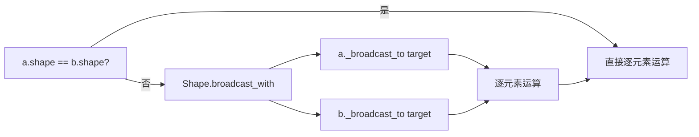

# 04 · NdArray 模块（`tinytorch.ndarr`）

`tinytorch.ndarr` 是整个框架的**数值内核层**，提供多维数组 `NdArray` 和形状管理 `Shape` 两个核心类。它不依赖 `autograd` / `nn` / `ml`，可以作为独立的数值库使用。

> 源码位置：`tinytorch/ndarr/ndarray.py`、`tinytorch/ndarr/shape.py`

## 4.1 功能总览

| 能力类别 | 具体方法 |
|----------|----------|
| **创建** | `NdArray(data, shape, dtype)`、`zeros`、`ones`、`randn`、`uniform` |
| **逐元素运算** | `add`、`sub`、`mul`、`div`、`neg`（支持标量 + 广播） |
| **矩阵运算** | `matmul`（仅 2D）、`transpose`、`reshape` |
| **归约运算** | `sum`、`mean`、`max`、`min`（支持 `axis` + `keepdims`） |
| **数学函数** | `exp`、`log`、`sqrt`、`pow` |
| **激活函数** | `relu`、`sigmoid`、`tanh` |
| **运算符重载** | `+ - * / @` 以及对应 `__r*__` 反向运算 |
| **广播** | 通过 `Shape.broadcast_with` + `NdArray._broadcast_to` 隐式完成 |
| **辅助** | `to_list`、`copy`、`__repr__` |

## 4.2 数据模型

`NdArray` 使用**扁平 Python 列表 + 行优先（C order）布局**存储数据，通过 `Shape` 描述多维结构：

```python
class NdArray:
    data: List[float | int]  # 扁平存储
    shape: Shape             # 形状信息
    dtype: str               # 'float32' 或 'int32'
```

内存布局示意（以 `Shape((2, 3))` 为例）：

```text
逻辑视图：                扁平存储：
┌───┬───┬───┐            ┌───┬───┬───┬───┬───┬───┐
│ 0 │ 1 │ 2 │            │ 0 │ 1 │ 2 │ 3 │ 4 │ 5 │
├───┼───┼───┤     →      └───┴───┴───┴───┴───┴───┘
│ 3 │ 4 │ 5 │            strides = (3, 1)
└───┴───┴───┘            linear(i,j) = i*3 + j
```

## 4.3 `Shape` 类

`Shape` 封装了维度、步长和广播规则。

### 4.3.1 核心属性

```python
shape = Shape((2, 3, 4))
shape.dims       # (2, 3, 4)
shape.ndim       # 3
shape.size       # 24
shape.strides    # (12, 4, 1)   ← 行优先布局
```

### 4.3.2 关键方法

| 方法 | 说明 |
|------|------|
| `linear_index(indices)` | 多维索引 → 扁平索引 |
| `can_broadcast(other)` | 是否可以与另一个 Shape 广播 |
| `broadcast_with(other)` | 返回广播后的 Shape（按 NumPy 规则） |
| `reshape(new_dims)` | 返回新 Shape（支持一个 `-1` 自动推断） |
| `transpose(axes)` | 返回维度置换后的新 Shape（`axes=None` 时反转） |

### 4.3.3 广播规则（与 NumPy 一致）

1. 从右向左逐维比较；
2. 两维度相等 **或** 其中一个为 1，视为兼容；
3. 缺失的维度视为 1；
4. 广播后的维度取两者最大值。

```python
Shape((3, 1, 4)).broadcast_with(Shape((2, 1))).dims
# (3, 2, 4)
```

## 4.4 创建 `NdArray`

### 4.4.1 从 Python 数据创建

```python
from tinytorch import NdArray

# 标量
a = NdArray(3.14)              # shape = (1,)

# 1D 列表
b = NdArray([1.0, 2.0, 3.0])   # shape = (3,)

# 嵌套列表（自动推断 shape）
c = NdArray([[1, 2], [3, 4]])  # shape = (2, 2)

# 指定 dtype
d = NdArray([1, 2, 3], dtype='int32')
```

### 4.4.2 工厂方法

```python
NdArray.zeros((2, 3))                    # 全 0
NdArray.ones((2, 3), dtype='int32')      # 全 1
NdArray.randn((2, 3))                    # 标准正态（Box-Muller 变换）
NdArray.randn((2, 3), seed=42)           # 固定种子
NdArray.uniform(-1.0, 1.0, (2, 3))       # 均匀分布 U(-1, 1)
```

> **随机数来源**：`randn` / `uniform` 依赖 `tinytorch.utils.random`。若传入 `seed`，会创建独立 RNG；否则复用全局 RNG。详见 [08 · 工具与数据加载](./08-工具与数据加载utils模块.md)。

## 4.5 运算

### 4.5.1 逐元素运算（支持广播 + 标量）

```python
a = NdArray([[1.0, 2.0], [3.0, 4.0]])
b = NdArray([[1.0, 1.0], [1.0, 1.0]])

a.add(b)          # 等价于 a + b
a.sub(b)          # a - b
a.mul(b)          # a * b
a.div(b)          # a / b
a.neg()           # -a

a.add(10)         # 标量广播
2 * a             # __rmul__
```

### 4.5.2 矩阵运算

```python
W = NdArray.randn((4, 3))
x = NdArray.randn((3, 5))
y = W.matmul(x)           # shape = (4, 5)；也可以写 W @ x

x.transpose()             # 默认反转所有维度
x.transpose((1, 0))       # 显式指定维度排列

x.reshape((5, 3))         # 支持 -1 自动推断：x.reshape((-1, 3))
```

> **限制**：`matmul` 当前**仅实现 2D × 2D**，高维批量矩阵乘请自行先 `reshape`。源码中 3D+ 会抛 `NotImplementedError("Only 2D matmul is currently supported")`。

### 4.5.3 归约运算

```python
t = NdArray([[1.0, 2.0, 3.0], [4.0, 5.0, 6.0]])

t.sum()                    # 所有元素求和 → NdArray([21.0])，shape=(1,)
t.sum(axis=0)              # 沿 axis 0 → NdArray([5, 7, 9])，shape=(3,)
t.sum(axis=1, keepdims=True)  # shape=(2, 1)

t.mean(axis=0)             # 均值
t.max(axis=1)              # 最大值
t.min()                    # 全局最小值
```

### 4.5.4 数学与激活函数

```python
t.exp()      # exp(x)，对 x > 709 返回 inf，x < -745 返回 0（由 constants 控制）
t.log()      # log(x)，x == 0 返回 -inf，x < 0 返回 nan
t.sqrt()     # sqrt(x)，x < 0 返回 nan
t.pow(2)     # x ** 2

t.relu()     # max(0, x)
t.sigmoid()  # 1 / (1 + exp(-x))，内部做极端值钳位
t.tanh()     # math.tanh
```

### 4.5.5 运算符重载

`NdArray` 重载了常见运算符，调用等价于显式方法：

| 运算符 | 等价调用 | 支持标量左侧 |
|--------|----------|---------------|
| `a + b` | `a.add(b)` | ✅ |
| `a - b` | `a.sub(b)` | ✅ |
| `a * b` | `a.mul(b)` | ✅ |
| `a / b` | `a.div(b)` | ✅（`scalar / NdArray` 对零值安全处理） |
| `-a` | `a.neg()` | – |
| `a @ b` | `a.matmul(b)` | – |

## 4.6 数值稳定性设计

`ndarr` 对几个典型"数值爆炸点"做了防御性处理，具体常量由 `tinytorch.constants` 统一管理：

| 场景 | 处理 | 对应常量 |
|------|------|----------|
| `exp(x)` 上溢 | `x > 709` 直接返回 `inf` | `EXP_OVERFLOW_THRESHOLD` |
| `exp(x)` 下溢 | `x < -745` 返回 `0.0` | `EXP_UNDERFLOW_THRESHOLD` |
| `log(0)` | 返回 `-inf`（不抛异常） | – |
| `log(负数)` | 返回 `nan` | – |
| `sqrt(负数)` | 返回 `nan` | – |
| `div by 0` | 按符号返回 `±inf` / `nan` | – |
| `Box-Muller` | `u1` 钳位到最小值避免 `log(0)` | `BOX_MULLER_MIN_U1` |

这些行为与 NumPy 保持一致，便于从 NumPy 迁移的读者快速建立预期。

## 4.7 广播的内部实现

广播是 `_elementwise_op` 的隐式能力，不需要用户手动调用。内部流程：



关键点（见 `_broadcast_to`）：

- 左侧补 1 对齐 `ndim`；
- 广播维度对应的 `stride` 被**置为 0**，天然复用相同元素；
- 使用迭代计数器生成目标索引，避免频繁调用 `_linear_to_indices`。

## 4.8 与 `autograd` 的分工

为避免混淆，这里特别澄清：

| 层 | 职责 | 是否追踪梯度 |
|----|------|--------------|
| `NdArray` | **纯数值**运算，不知道"梯度"为何物 | ❌ |
| `Tensor` | 包装 `NdArray`，在其上构建计算图 | ✅ |

因此：

- 写自定义算子时，`Function.forward()` 接收/返回的是 `NdArray`；
- `Function.backward()` 里做的矩阵运算也用 `NdArray` 的 API，不要引入 `Tensor`。

## 4.9 使用约束与已知限制

- **维度必须 ≥ 1**：`Shape` 不支持 0 维标量 shape，标量会被存为 `Shape((1,))`。
- **维度必须为正整数**：`Shape.__init__` 会校验 `d > 0`。
- **`dtype` 仅两种**：`float32` / `int32`，其他类型会抛 `ValueError`。
- **嵌套列表不能"参差不齐"**：`[[1,2], [3]]` 会被拒绝（`ragged dimensions are not allowed`）。
- **`matmul` 仅 2D**：更高维需用户显式 `reshape`。
- **性能**：纯 Python 嵌套循环，大 shape 矩阵乘法非常慢；本模块的目标是可读性而非性能。

## 4.10 完整示例：手写线性变换

下面的示例**只用 `ndarr`**（不引入 `autograd`）实现一次 `y = x @ W.T + b`：

```python
from tinytorch import NdArray

x = NdArray.randn((8, 4))          # batch=8, in_features=4
W = NdArray.randn((3, 4))          # out_features=3, in_features=4
b = NdArray.zeros((3,))

# y = x @ W.T + b
y = x.matmul(W.transpose())        # (8, 3)
y = y.add(b)                       # 广播 (3,) 到 (8, 3)

print(y.shape.dims)                # (8, 3)
print(y.to_list())                 # 嵌套列表
```

---

**上一篇** ← [03 · 架构设计](./03-架构设计.md)  ·  **下一篇** → [05 · Autograd 模块](./05-Autograd模块.md)
