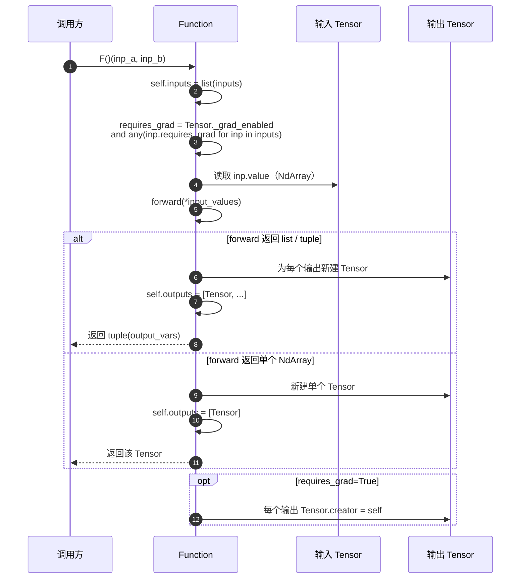

# 05 · Autograd 模块（`tinytorch.autograd`）

`tinytorch.autograd` 是框架的**自动微分引擎**，在 `NdArray` 之上构建**动态计算图**，支持反向模式自动微分（reverse-mode AD）。本文对应源码：

- `tinytorch/autograd/tensor.py` —— `Tensor`、`no_grad`
- `tinytorch/autograd/function.py` —— `Function` 基类
- `tinytorch/autograd/graph_viz.py` —— 计算图可视化
- `tinytorch/autograd/ops/` —— 内置算子实现（按 basic / math / matrix / reduce / activation / nn / loss / conv 分文件）

## 5.1 核心概念

| 概念 | 说明 |
|------|------|
| **Tensor** | 计算图的**节点**，包装一个 `NdArray` 并记录 `grad`、`creator`、`requires_grad` |
| **Function** | 计算图的**边**（算子），定义 `forward` 和 `backward` 规则 |
| **计算图** | 运行时动态构建的 DAG：节点是 `Tensor`，边是 `Function` |
| **反向传播** | 从输出 `Tensor` 出发，沿图反向调用 `backward`，把梯度累加到叶子节点 |
| **`no_grad()`** | 全局开关，暂时关闭所有 `Tensor` 的梯度追踪 |

## 5.2 `Tensor` 类

### 5.2.1 属性

| 属性 | 含义 |
|------|------|
| `value: NdArray` | 张量值（真正的数据） |
| `grad: NdArray \| None` | 梯度，`backward()` 后填充 |
| `creator: Function \| None` | 创建本张量的 `Function`；叶子节点为 `None` |
| `requires_grad: bool` | 是否参与梯度追踪 |
| `name: str` | 可选的调试名 |

只读属性（委托给 `value`）：

| 属性 | 含义 |
|------|------|
| `shape` | `Shape` 对象 |
| `data` | 扁平数据 list（可读/可写） |
| `ndim` | 维度数 |
| `size` | 元素总数 |
| `dtype` | 数据类型 |

### 5.2.2 构造

`Tensor.__init__` 的完整签名（见 `tinytorch/autograd/tensor.py`）：

```python
Tensor(value: NdArray,
       name: Optional[str] = None,
       requires_grad: bool = True)
```

示例：

```python
from tinytorch import NdArray, Tensor

# 必须用 NdArray 包装，不能直接传 Python 列表
x = Tensor(NdArray([[1.0, 2.0]]), name="x")

# 明确关闭梯度追踪（例如用于数据输入）
y = Tensor(NdArray([[3.0, 4.0]]), requires_grad=False)
```

> ⚠️ 非法用法：`Tensor([1.0, 2.0])` 会抛 `TypeError`（`Tensor value must be NdArray, got ...`），因为 `__init__` 对 `value` 做了严格类型检查。
> 
> 💡 `name` 省略时会自动生成形如 `"var_<id>"` 的默认名，主要用于调试与计算图可视化。

### 5.2.3 运算与方法

所有运算本质上是"创建对应 `Function` 并调用它"。`Tensor` 提供两种触发方式：

**（a）方法调用**：

```python
z = x.add(y)          # 加
z = x.sub(y)          # 减
z = x.mul(y)          # 乘
z = x.div(y)          # 除
z = x.neg()           # 取负
z = x.pow(2)          # 幂
z = x.exp(); x.log(); x.sqrt()

z = x.matmul(y)       # 矩阵乘
z = x.transpose()     # 转置
z = x.reshape((2, 3)) # reshape

z = x.sum(axis=0, keepdims=True)
z = x.mean(axis=1)

z = x.relu(); x.sigmoid(); x.tanh(); x.leaky_relu(0.01)
```

**（b）运算符重载**（全部都会构建计算图）：

| 运算符 | 调用 |
|--------|------|
| `a + b` / `b + a` | `a.add(b)` |
| `a - b` / `b - a` | `a.sub(b) / b.sub(a)` |
| `a * b` / `b * a` | `a.mul(b)` |
| `a / b` / `b / a` | `a.div(b) / b.div(a)` |
| `-a` | `a.neg()` |
| `a ** k` | `a.pow(k)` |
| `a @ b` | `a.matmul(b)` |

标量与 `Tensor` 混算会自动把标量包装为 **`requires_grad=False` 的临时 Tensor**（见 `Tensor._ensure_tensor`）。

### 5.2.4 `backward()`

```python
def backward(self,
             grad_output: Optional[Union[Tensor, NdArray]] = None,
             retain_graph: bool = False) -> None
```

| 参数 | 说明 |
|------|------|
| `grad_output` | 输出端的梯度。**标量输出可省略**（默认填 `ones`）；**非标量输出必须显式提供**，否则抛 `ValueError` |
| `retain_graph` | 是否在反传后保留计算图。默认 `False`：反传完成会主动断开 `creator`，释放 `Function` / 中间张量 |

### 5.2.5 其他实例方法

| 方法 | 作用 |
|------|------|
| `clear_grad()` | 将 `self.grad` 置 `None` |
| `detach()` | 返回一个**拷贝了 `value` 的新 `Tensor`**（`requires_grad=False`、`creator=None`），`name` 为原名加 `_detached` 后缀；因为底层调用的是 `NdArray.copy()`，所以对原张量的后续原地修改不会影响它 |
| `unchain_backward()` | 以自己为起点，沿 `creator` 链 DFS 访问所有可达的 `Tensor` 和 `Function`，清空各 `Function` 的 `saved_tensors` 并把相关 `Tensor.creator` 置 `None`；用 `visited_tensors` / `visited_functions` 两个集合保证多输出指向同一 `creator` 时不重复清理 |

## 5.3 `Function` 基类

### 5.3.1 定义

```python
from tinytorch.autograd.function import Function
from tinytorch.ndarr import NdArray

class MyOp(Function):
    def forward(self, *inputs: NdArray) -> NdArray:
        """纯数值运算，返回 NdArray（或元组）"""
        ...

    def backward(self, grad_output: NdArray) -> List[NdArray]:
        """根据输出梯度计算每个输入的梯度"""
        ...
```

### 5.3.2 运行时生命周期

`Function.call(*inputs)` 是把一个 `Function` "挂到计算图"的入口，流程如下：



关键点：

- **`forward` 操作 `NdArray`**，不是 `Tensor`；
- `requires_grad` 由**输入张量 + `Tensor._grad_enabled`（全局开关）**共同决定：任一输入需要梯度**且**全局追踪开启时，输出才会需要梯度；
- 输出 `Tensor` 的 `creator` 指向 `self`，反传时就能找到它；
- **多输出算子**（如 `LSTM` 的 `(h, c)`）通过 `forward` 返回 `list` 或 `tuple` 实现，`call` 会把它们统一包装成 `tuple(Tensor, ...)`。

### 5.3.3 保存反向所需张量

```python
def forward(self, x, y):
    self.save_for_backward(x, y)   # 存入 self.saved_tensors
    return x.matmul(y)

def backward(self, grad_output):
    x, y = self.get_saved_tensors()
    return [grad_output.matmul(y.transpose()),
            x.transpose().matmul(grad_output)]
```

**约束**（源码明确说明）：

- 必须在 `forward()` 中调用；
- 只能保存 `NdArray`；
- 每次调用会**覆盖**之前保存的内容（需一次传入所有需要保存的张量）；
- `backward()` 结束后框架会自动清理（通过 `clear_saved_tensors()`），**不要跨多次 backward 复用**。

## 5.4 反向传播完整流程

以 `loss.backward()` 为入口的调用链：

```text
Tensor.backward(grad_output, retain_graph)
    │
    ├─ 1. 校验 requires_grad（False 则直接返回）
    │
    ├─ 2. _init_grad(grad_output)
    │     ├─ 标量输出：默认 grad = ones(shape)
    │     └─ 非标量输出：grad_output 必填，且 shape 必须一致
    │
    ├─ 3. _topological_sort()
    │     └─ 用显式栈 + 三状态染色（_UNVISITED/_IN_PROGRESS/_DONE）
    │        做迭代式 DFS，避免深图递归栈溢出
    │
    ├─ 4. _propagate_gradients(topo_order)
    │     └─ 按逆拓扑序：
    │        for node in reversed(topo):
    │            grad_inputs = node.creator.backward(node.grad)
    │            for inp, g in zip(node.creator.inputs, grad_inputs):
    │                if inp.requires_grad:
    │                    inp.grad = g if inp.grad is None else inp.grad.add(g)
    │
    └─ 5. 若 retain_graph=False → unchain_backward()
          └─ 清空 creator 引用、saved_tensors，帮助 GC 回收
```

### 5.4.1 梯度累加语义

若同一张量被计算图引用多次（菱形依赖、双塔网络等），反传时会**自动累加**梯度——这也是为什么每步训练开始前要调用 `optimizer.zero_grad()`。

```python
x = Tensor(NdArray([2.0]))
y = x * x + x * 3   # x 被两条路径引用
y.backward()
# x.grad = 2*x + 3 = 7
```

### 5.4.2 标量输出 vs 非标量输出

```python
# 标量输出：直接 backward()
loss = ((pred - target) ** 2).mean()
loss.backward()

# 非标量输出：必须显式提供 grad_output
y = x * 2                         # shape = x.shape，非标量
y.backward(grad_output=NdArray.ones(y.shape))
```

## 5.5 `no_grad()` 上下文

`no_grad()` 通过修改 `Tensor._grad_enabled` 这个类变量控制**全局**梯度追踪：

```python
from tinytorch import no_grad

with no_grad():
    # 这里创建的所有 Tensor 都不会构建计算图
    pred = model(x)
    # pred.creator is None
```

适用场景：

- **推理阶段**：节省内存、加速运算；
- **验证集评估**：避免梯度意外污染；
- **参数原地更新辅助计算**：如计算 EMA、观察激活分布等。

**注意事项**：

- 可**嵌套使用**，退出时恢复进入前的状态；
- 对 `requires_grad=False` 的张量无影响（它们本来就不会构图）；
- `no_grad()` 仅影响**计算图构建**，不影响 `NdArray` 级别的运算。

## 5.6 计算图可视化（`graph_viz`）

`tinytorch.autograd.graph_viz` 提供以下公共接口（源码：`tinytorch/autograd/graph_viz.py`）：

| 函数 | 签名 | 作用 |
|------|------|------|
| `extract_graph` | `extract_graph(output_tensor, max_depth=100)` | 从输出 `Tensor` 出发做 BFS 回溯，返回 `{'nodes': [...], 'edges': [...]}` 字典；节点含 `id / type / label / shape / depth` 等字段，`type` 取值为 `'tensor'`（带 `subtype='leaf'` 或 `'intermediate'`）或 `'function'`；`depth=0` 为输出层，越大越靠近输入。若 `output_tensor` 不是 `Tensor` 会抛 `TypeError` |
| `visualize_graph` | `visualize_graph(output_tensor=None, port=8098, auto_open=True, module=None)` | 启动一个本地 HTTP 服务器（绑定 `127.0.0.1:port`），在浏览器中查看计算图。可同时传 `module` 附带模块层级结构；返回创建的 `HTTPServer` 实例以便手动 `shutdown()` |
| `export_graph_html` | `export_graph_html(output_tensor, file_path, module=None)` | 把图数据以 `<script>` 形式内嵌到 HTML 模板（`tinytorch.ml.graph_template.GRAPH_HTML`），导出为可**离线**打开的单文件 HTML |
| `extract_module_graph` | `extract_module_graph(module)` | 仅遍历 `nn.Module` 子模块树，生成层级结构图（`depth` / `order` / `parent` / `children`） |

> ⚠️ 计算图节点存活期：`extract_graph` 必须在 `Tensor.backward()` 之前调用，或反传时显式传 `retain_graph=True`。默认的 `backward()` 会调用 `unchain_backward()` 清空所有 `creator`，之后再调用 `extract_graph` 只能看到输出节点本身。

典型用法：

```python
from tinytorch.autograd import export_graph_html, visualize_graph

loss = model(x).sub(target).pow(2).mean()

# 方式 1：导出为离线 HTML
export_graph_html(loss, "loss_graph.html")

# 方式 2：直接在浏览器打开（开启本地服务）
server = visualize_graph(loss, port=8098, auto_open=True, module=model)
# 用完后 server.shutdown()
```

## 5.7 内置算子一览

`tinytorch/autograd/ops/` 按功能分文件实现了全部内置算子：

| 文件 | 代表算子 |
|------|----------|
| `ops/basic.py` | `Add`、`Sub`、`Mul`、`Div`、`Neg` |
| `ops/math_ops.py` | `Pow`、`Exp`、`Log`、`Sqrt` |
| `ops/matrix.py` | `MatMul`、`Transpose`、`Reshape` |
| `ops/reduce.py` | `Sum`、`Mean` |
| `ops/activation.py` | `ReLU`、`Sigmoid`、`Tanh`、`LeakyReLU` |
| `ops/loss.py` | `CrossEntropy`、`BinaryCrossEntropy` 等 |
| `ops/conv.py` | `Conv2d` 前反向 |
| `ops/nn.py` | `EmbeddingLookup`、`TimeSlice`、`StackTime`、`SplitHeads`、`MergeHeads`、`ScaledDotProductAttention` 等 |

`Tensor` 的方法会**按需动态 import** 对应模块（见 `Tensor._apply_binary_op` / `_apply_unary_op`），避免循环依赖。

## 5.8 自定义算子示范

下面实现一个"平方加常数" `y = x^2 + c` 的算子（**仅用于演示**，实际可用 `x * x + c` 组合现有算子完成）：

```python
from tinytorch.autograd.function import Function
from tinytorch.ndarr import NdArray


class SquarePlus(Function):
    def __init__(self, c: float):
        super().__init__()
        self.c = c

    def forward(self, x: NdArray) -> NdArray:
        self.save_for_backward(x)
        return x.mul(x).add(self.c)   # x^2 + c

    def backward(self, grad_output: NdArray):
        (x,) = self.get_saved_tensors()
        # dy/dx = 2x
        grad_x = grad_output.mul(x).mul(2.0)
        return [grad_x]


# 使用
from tinytorch import NdArray, Tensor
x = Tensor(NdArray([3.0]))
y = SquarePlus(c=1.0)(x)     # 即 Function.__call__
y.backward()
assert x.grad.data == [6.0]  # 2x = 6
```

## 5.9 常见陷阱

| 陷阱 | 说明与建议 |
|------|-----------|
| **对非标量调用 `backward()`** | 会抛 `ValueError`；请显式传 `grad_output=NdArray.ones(...)` 或先 `mean()` / `sum()` 成标量 |
| **忘记 `zero_grad()`** | 梯度会**累加**到上一轮！训练循环每步前调用 `optimizer.zero_grad()` 或 `model.zero_grad()` |
| **在 `forward` 中使用 `Tensor`** | `Function.forward` 只接 `NdArray`，误写会报 `TypeError` |
| **跨多次 backward 复用 `saved_tensors`** | 默认 `retain_graph=False` 会清理，请传 `retain_graph=True` 或重新前向 |
| **对叶子张量就地修改 `value`** | 参数更新依赖"替换 `value`" 而非"修改计算图节点"。`SGD.step()` / `Adam.step()` 的实现就是直接做 `param.value = param.value.sub(...)`（返回新的 `NdArray`），这一步没有构图，因为**发生在 `NdArray` 层而不是 `Tensor` 层**，所以不需要 `no_grad()`；但如果你要在 `Tensor` 层做类似的更新，需自行确保不污染图 |

## 5.10 性能提示

- 动态图在纯 Python 下开销较大，每个算子都会分配新的 `NdArray` 与 `Tensor`；
- 训练循环里尽量避免在 hot path 创建大量小张量；
- 推理时务必加 `with no_grad():` 以跳过图构建；
- 深图（>1000 节点）在本实现下拓扑排序已使用显式栈，不会栈溢出，但仍会受 Python 循环速度限制。

---

**上一篇** ← [04 · NdArray 模块](./04-NdArray模块.md)  ·  **下一篇** → [06 · 神经网络（nn）模块](./06-神经网络nn模块.md)
