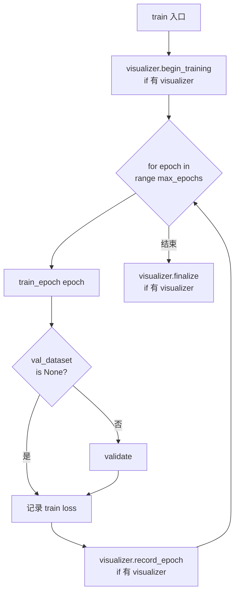

# 07 · 训练框架（`tinytorch.ml`）

`tinytorch.ml` 把"训练一个模型"所需的周边能力整合到一起：模型管理 / 训练循环 / 优化器 / 损失函数 / 评估器 / 数据集 / 监控 / 可视化。相关源码位于 `tinytorch/ml/`。

## 7.1 模块结构

```text
tinytorch/ml/
├── model.py          # Model: 模型生命周期管理（save / load / state_dict）
├── trainer.py        # Trainer: 训练循环控制器
├── dataset.py        # DataSet: 简易数据集 + 批次生成
├── monitor.py        # Monitor / EarlyStopping: 指标监控与早停
├── visualizer.py     # TrainingVisualizer: Web 可视化服务
├── viz_template.py   # 训练可视化 HTML 模板
├── graph_template.py # 计算图可视化 HTML 模板
├── optimizers/       # Optimizer / SGD / Adam
├── losses/           # Loss / MSELoss / CrossEntropyLoss / BCELoss
└── evaluators/       # Evaluator / AccuracyEvaluator / PrecisionRecallEvaluator / RegressionEvaluator
```

通过 `from tinytorch.ml import Model, Trainer, SGD, Adam, MSELoss, ...` 一次导入常用类。

## 7.2 `Model` —— 模型生命周期管理

`Model` 是对 `nn.Module` 的薄封装，提供持久化和"模型 vs 结构"分离的能力。

### 7.2.1 构造与转发

```python
from tinytorch.nn import Sequential, Linear, ReLU
from tinytorch.ml import Model

net = Sequential(Linear(10, 20), ReLU(), Linear(20, 5))
model = Model(name='MyModel', module=net)

# 转发调用
y = model(x)            # 等价于 model.module(x)
model.train()           # 递归到 module
model.eval()
model.zero_grad()
params = model.parameters()
```

### 7.2.2 保存 / 加载

⚠️ **安全警告**：所有 `save / load` 方法都使用 Python `pickle`，**切勿加载不可信来源的文件**，否则可能导致远程代码执行（RCE）。

| 方法 | 作用 |
|------|------|
| `model.save(path)` | 保存 `{name, model_info, training, module_state_dict}` |
| `Model.load(path, module=...)` | 加载状态字典。⚠️ **必须传入已构建好的 `module`**，否则会抛 `ValueError` |
| `model.save_parameters(path)` | 仅保存 `state_dict` |
| `model.load_parameters(path)` | 非严格加载（`strict=False`） |

为什么要求外部先构建 `module`？因为 `state_dict` 只保存了参数张量，**不保存网络结构**。恢复时必须先用相同的代码搭出一样的结构，再把参数灌回去：

```python
# 保存
model = Model('MyModel', Sequential(Linear(10, 20), ReLU(), Linear(20, 5)))
model.save('model.pkl')

# 加载
net_new = Sequential(Linear(10, 20), ReLU(), Linear(20, 5))   # 结构相同
loaded = Model.load('model.pkl', module=net_new)
```

## 7.3 `Optimizer` —— 优化器

### 7.3.1 基类 `Optimizer`

```python
Optimizer(params: List[Parameter], learning_rate: float = 0.01, **kwargs)
```

- 接受 `lr` 作为 `learning_rate` 的别名（`lr=0.01` 等价于 `learning_rate=0.01`）；
- `optimizer.lr` 属性可读可写；
- 提供 `zero_grad()`（遍历所有参数 `clear_grad`）、`state_dict()` / `load_state_dict()`；
- `step()` 是抽象方法，子类必须实现，未实现调用会抛 `NotImplementedError`。

### 7.3.2 `SGD`

```python
SGD(params, learning_rate=0.01, momentum=0.0, weight_decay=0.0)
```

**更新规则**：

- 无动量：`param ← param - lr * (grad + weight_decay * param)`
- 有动量：

  ```
  velocity ← momentum * velocity + grad + weight_decay * param
  param    ← param - lr * velocity
  ```

- 第一次使用动量时 `velocity` 会被初始化为与参数同形状的零 `NdArray`；
- 如果参数的 `grad` 形状与参数本身不一致，会先 `reshape` 对齐再更新。

### 7.3.3 `Adam`

```python
Adam(params, learning_rate=0.001, beta1=0.9, beta2=0.999,
     epsilon=1e-8, weight_decay=0.0)
```

**更新规则**（`t` 是更新步数，从 1 开始）：

```
m_t = beta1 * m_{t-1} + (1 - beta1) * grad
v_t = beta2 * v_{t-1} + (1 - beta2) * grad²
m_hat = m_t / (1 - beta1^t)
v_hat = v_t / (1 - beta2^t)
param ← param - lr * m_hat / (sqrt(v_hat) + epsilon)
```

- 支持 `betas=(beta1, beta2)` 元组关键字（PyTorch 风格）；
- 一阶矩 `m`、二阶矩 `v` 在构造时就为每个参数预分配零 `NdArray`；
- 权重衰减以"加到梯度上"的方式实现（即传统 L2 正则，非 AdamW）。

### 7.3.4 训练循环里的标准位置

```python
optimizer.zero_grad()    # 1. 清零梯度
loss.backward()          # 2. 反向传播累积梯度
optimizer.step()         # 3. 依据梯度更新参数
```

三步顺序不可颠倒：不清零会把上一步梯度累加；不 `backward` 则 `grad` 为 `None`（`step` 会跳过该参数）；不 `step` 就不会更新。

## 7.4 `Loss` —— 损失函数

### 7.4.1 基类

```python
class Loss:
    def __init__(self, name=None, reduction='mean'):
        ...
    def forward(self, pred: Tensor, target: Tensor) -> Tensor:
        raise NotImplementedError
    def __call__(self, pred, target):
        return self.forward(pred, target)
```

- `reduction` 必须是 `'mean'` / `'sum'` / `'none'` 三者之一，否则抛 `ValueError`；
- 所有损失都返回 `Tensor`，可直接 `loss.backward()`。

### 7.4.2 `MSELoss`

```python
MSELoss(reduction='mean')
```

计算 `(pred - target) ** 2`，按 `reduction` 归约。返回的张量 shape：

| `reduction` | 输出形状 |
|------------|----------|
| `'mean'` | `(1,)` 标量 |
| `'sum'` | `(1,)` 标量 |
| `'none'` | 与 `pred` 同形状 |

### 7.4.3 `CrossEntropyLoss`

```python
CrossEntropyLoss(reduction='mean')
```

- 输入 `logits`：形状 `(batch_size, num_classes)`；
- 输入 `target`：形状 `(batch_size,)`，值为**类别索引**（整数）；
- 内部直接调用 `autograd.ops.loss.CrossEntropy`，它融合了 softmax + log + nll，从数值稳定性角度一步完成；
- 不需要（也不应该）在模型末尾先接 `Softmax` 再喂给这个损失。

### 7.4.4 `BCELoss`

```python
BCELoss(reduction='mean')
```

- 输入 `input`：预测**概率**，必须已经过 `Sigmoid`（和 PyTorch 的 `BCELoss` 一致，与 `BCEWithLogitsLoss` 不同）；
- 形状 `(batch_size,)` 或 `(batch_size, 1)`；
- 对应算子：`autograd.ops.loss.BinaryCrossEntropy`。

## 7.5 `Evaluator` —— 指标评估器

评估器作用在**原始 Python 列表 / 嵌套列表**上（不是 `Tensor`），多用于拿到预测结果后的离线指标计算。

| 类 | 指标 | 关键用法 |
|----|------|----------|
| `AccuracyEvaluator` | 准确率 | `predictions` 可以是类别索引或每个样本的概率向量（内部会取 `argmax`） |
| `PrecisionRecallEvaluator(average='binary')` | P / R / F1 | `evaluate_all()` 返回 `{'precision', 'recall', 'f1'}`；`evaluate()` 只返 F1 |
| `RegressionEvaluator` | MAE / MSE / RMSE | `evaluate_all()` 返回 `{'mae', 'mse', 'rmse'}`；`evaluate()` 只返 MSE |

示例：

```python
from tinytorch.ml import AccuracyEvaluator

acc_eval = AccuracyEvaluator()

predictions = [[0.1, 0.9], [0.8, 0.2], [0.3, 0.7]]   # 每行是概率向量
targets = [1, 0, 1]
print(acc_eval(predictions, targets))                # 1.0
```

> 📌 内部工具 `_to_class_indices` 会自动把概率向量转为 `argmax` 索引，再与目标比较；所以同时支持概率和类别索引两种输入。

## 7.6 `DataSet` —— 简易数据集

`tinytorch.ml.DataSet` 是早期的数据集抽象，继承自 `tinytorch.utils.data.Dataset`。**推荐新代码使用 `tinytorch.utils.data.DataLoader` + `Dataset`**（见 08 章），`DataSet` 更多用于兼容旧 API 与 `Trainer`。

### 7.6.1 构造与批次迭代

```python
from tinytorch.ml import DataSet

dataset = DataSet(
    data=[[1, 2], [3, 4], [5, 6], [7, 8]],
    labels=[0, 1, 0, 1],
    batch_size=2,
    shuffle=True,
)

len(dataset)                       # 4
data_i, label_i = dataset[0]       # 单样本 (索引访问)

# 惰性迭代（推荐）—— 返回 NdArray
for batch_data, batch_labels in dataset.iter_batches():
    print(batch_data.shape.dims)   # (2, 2)

# 一次性取全部批次
batches = dataset.get_batches()    # List[Tuple[NdArray, NdArray]]
```

- `shuffle=True` 时，每次迭代**开头**会调用 `shuffle_data()` 打乱内部索引；
- `iter_batches()` 是生成器，按需产出 `NdArray`；`get_batches()` 等价于 `list(iter_batches())`；
- `__iter__` 产出的是**未转 `NdArray` 的原始列表**（便于自定义 collate），这与 `iter_batches` 不同，注意区别。

### 7.6.2 切分数据集

```python
train_set, val_set = dataset.split(ratio=0.8)   # 80% 训练，20% 验证
```

- `ratio` 必须在开区间 `(0, 1)`，否则抛 `ValueError`；
- 切分前会先打乱索引副本，但**不影响原数据集**；
- 切出的 `val_set` 默认 `shuffle=False`。

## 7.7 `Trainer` —— 训练循环控制器

`Trainer` 把"前向 → 损失 → 反向 → 参数更新 → 日志 → 验证"编织在一起，屏蔽 epoch / batch 的样板代码。

### 7.7.1 构造

```python
Trainer(model: Model,
        dataset: DataSet,
        optimizer: Optimizer,
        loss_fn: Loss,
        max_epochs: int = 10,
        print_interval: int = 10,
        val_dataset: Optional[DataSet] = None,
        visualizer: Optional[TrainingVisualizer] = None)
```

### 7.7.2 训练流程

调用 `trainer.train()` 会执行：



`train_epoch` 的每个 batch 内部：

```text
optimizer.zero_grad()
input_tensor  = Tensor(batch_data, requires_grad=False)
target_tensor = Tensor(batch_labels, requires_grad=False)
output = model(input_tensor)
loss   = loss_fn(output, target_tensor)
loss.backward()
optimizer.step()
```

`validate` 会切到 `eval()` 模式并用 `with no_grad():` 包裹整个循环，避免浪费梯度计算。

### 7.7.3 检查点

```python
trainer.save_checkpoint('ckpt.pkl')
trainer.load_checkpoint('ckpt.pkl')
```

保存内容：

```python
{
    'model_name': ...,
    'model_state': model.module.to_dict(),      # 含 class / name / training / state_dict
    'optimizer_state': optimizer.state_dict(),  # 含 learning_rate / state
    'train_losses': [...],
    'val_losses': [...],
}
```

⚠️ 同样基于 `pickle`，不要加载不可信文件。

> **注意**：当前 `load_checkpoint` 只恢复 `optimizer_state`、`train_losses`、`val_losses`，**不会**回填到 `model.module` 的参数；如果需要恢复模型权重，请配合 `Model.load(..., module=your_new_module)` 使用。

### 7.7.4 完整示例

```python
from tinytorch.nn import Sequential, Linear, ReLU
from tinytorch.ml import Model, Trainer, DataSet, SGD, MSELoss

# 构造假数据（y = x1 + 2*x2 + 3*x3）
data   = [[i, i + 1, i + 2] for i in range(100)]
labels = [[x1 + 2 * x2 + 3 * x3] for x1, x2, x3 in data]

ds_train, ds_val = DataSet(data, labels, batch_size=16).split(0.8)

net = Sequential(Linear(3, 16), ReLU(), Linear(16, 1))
model = Model('Regressor', net)

trainer = Trainer(
    model=model,
    dataset=ds_train,
    optimizer=SGD(model.parameters(), learning_rate=0.001),
    loss_fn=MSELoss(),
    max_epochs=50,
    print_interval=5,
    val_dataset=ds_val,
)
trainer.train()
```

## 7.8 `Monitor` 与 `EarlyStopping`

### 7.8.1 `Monitor`

简单的指标累计器，不参与训练循环，但可以放进你自己的循环里：

```python
from tinytorch.ml import Monitor

monitor = Monitor()
monitor.start()

for epoch in range(50):
    train_loss, val_loss = train_one_epoch(), evaluate()
    monitor.record_epoch(epoch, {'train_loss': train_loss, 'val_loss': val_loss})
    monitor.print_epoch(epoch, {'train_loss': train_loss, 'val_loss': val_loss})

best = monitor.get_best('val_loss', mode='min')
monitor.print_summary()
monitor.save_history('history.pkl')     # ⚠️ pickle
```

- `get_best(name, mode='min'|'max')`：对应 `min()` / `max()`；其他 `mode` 抛 `ValueError`；
- `record_epoch(epoch, metrics)` 会同时写入 `metrics[name]` 历史列表和 `history[]` 逐 epoch 记录；
- `save_history` / `load_history` 基于 `pickle`，仅用于本地调试。

### 7.8.2 `EarlyStopping`

```python
es = EarlyStopping(patience=5, mode='min', min_delta=0.0)

for epoch in range(100):
    val_loss = validate()
    if es.step(val_loss):
        print('Early stop')
        break
```

- `mode='min'`：当前分数 `< best - min_delta` 算作改善，否则计数器 +1；
- `mode='max'`：反之；
- 达到 `patience` 次没有改善时，`step` 返回 `True` 并把 `should_stop` 置为 `True`；
- `reset()` 可以清零状态重新开始。

## 7.9 `TrainingVisualizer` —— Web 可视化

`visualizer.py` 基于 Python 标准库 `http.server` + 前端 Plotly.js 模板，做到 0 外部依赖。

### 7.9.1 作为独立工具

```python
from tinytorch.ml import TrainingVisualizer

viz = TrainingVisualizer(port=8097, auto_open=True)
viz.start_server()
viz.begin_training()

for epoch in range(50):
    viz.record_epoch(epoch,
                     train_loss=train_loss,
                     val_loss=val_loss,
                     accuracy=acc,      # 任意自定义指标
                     lr=0.001)

viz.finalize()
viz.save_data('training.json')
viz.export_html('training.html')       # 离线 HTML（内嵌数据）
```

### 7.9.2 与 `Trainer` 搭配

把实例传给 `Trainer` 后，框架会自动调用 `begin_training` / `record_epoch` / `finalize`：

```python
trainer = Trainer(..., visualizer=TrainingVisualizer(port=8097))
trainer.train()
```

### 7.9.3 附带展示计算图

```python
viz.set_graph(output_tensor=loss, module=model.module)
# 浏览器打开 http://localhost:8097/graph 查看
```

- 必须在 `backward()` **之前**调用，否则 `creator` 链已被清空；
- 或者在 `backward(retain_graph=True)` 之后再调用。

### 7.9.4 接口速查

| 方法 | 说明 |
|------|------|
| `start_server()` / `stop_server()` | 启动 / 停止 HTTP 服务（后台 daemon 线程） |
| `begin_training()` | 记录开始时间、状态置 `'running'` |
| `record_epoch(epoch, train_loss=..., val_loss=..., **extra)` | 追加一轮数据；`extra` 会落入 `custom_metrics` |
| `finalize()` | 状态置 `'done'`；服务器**不**自动关闭 |
| `get_data_snapshot()` / `get_graph_snapshot()` | 线程安全快照 |
| `save_data(path)` / `load_data(path)` | JSON 存读 |
| `export_html(path)` | 导出自带数据的单文件 HTML |
| `set_graph(output_tensor, module)` | 设置要展示的计算图 |

## 7.10 典型组合：完整训练脚本

```python
from tinytorch import NdArray
from tinytorch.nn import Sequential, Linear, ReLU
from tinytorch.ml import (
    Model, Trainer, DataSet,
    Adam, CrossEntropyLoss,
    TrainingVisualizer, EarlyStopping,
)

# 1. 数据
data = [...]    # shape: (N, features)
labels = [...]  # shape: (N,) 类别索引
ds_train, ds_val = DataSet(data, labels, batch_size=32).split(0.9)

# 2. 模型
net = Sequential(Linear(784, 128), ReLU(), Linear(128, 10))
model = Model('MLP', net)

# 3. 训练器 + 可视化
viz = TrainingVisualizer(port=8097)
trainer = Trainer(
    model=model,
    dataset=ds_train,
    optimizer=Adam(model.parameters(), learning_rate=1e-3),
    loss_fn=CrossEntropyLoss(),
    max_epochs=30,
    val_dataset=ds_val,
    visualizer=viz,
)
trainer.train()

# 4. 保存
model.save('mlp.pkl')
viz.export_html('training.html')
```

## 7.11 注意事项与最佳实践

- **`Trainer` 与 `DataSet` 耦合**：`Trainer` 目前只接受 `DataSet`（内部依赖 `iter_batches()`、`batch_size`）；如果你已经切换到 `tinytorch.utils.data.DataLoader`，请自行手写训练循环。
- **标量损失取值**：`Trainer` 内部用 `loss.value.data[0]` 拿标量；若你写自定义 Trainer，请确保 `loss` 经过了 `mean()` / `sum()` 归约。
- **梯度清零时机**：`Trainer._train_step` 每个 batch 都会先 `zero_grad()`，别再额外调用 `model.zero_grad()` 造成重复。
- **checkpoint 权重不会被恢复**：见 7.7.3 的注意，`load_checkpoint` 不触碰 `model.module`。
- **Pickle 安全**：任何 `save / load` 文件都不要来自不可信来源。

---

**上一篇** ← [06 · 神经网络（nn）模块](./06-神经网络nn模块.md)  ·  **下一篇** → [08 · 工具与数据加载（utils）模块](./08-工具与数据加载utils模块.md)
