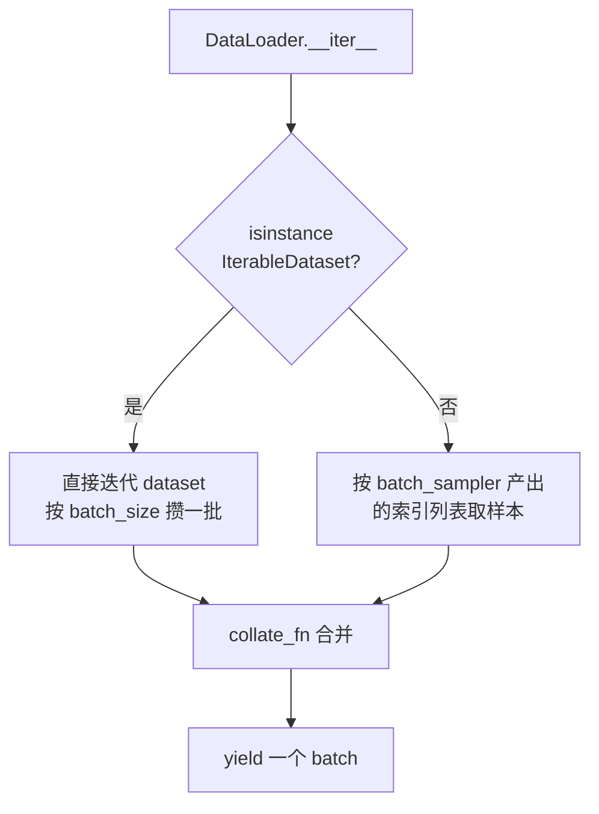

# 08 · 工具与数据加载（`tinytorch.utils`）

`tinytorch.utils` 汇聚了框架的周边基础设施：PyTorch 风格的**数据加载管线**（`tinytorch.utils.data`）与**全局随机数工具**（`tinytorch.utils.random`）。它们被 `nn` / `ml` 等模块内部广泛使用，也可以直接对外使用。

## 8.1 `tinytorch.utils.random` —— 随机数工具

> 源码：`tinytorch/utils/random.py`

全框架共享一个全局 `random.Random` 实例 `_GLOBAL_RNG`。`nn.init`、`Dropout`、`NdArray.randn` / `uniform`、`DataSet.shuffle` 等所有涉及随机性的地方默认都用它；这样**只要设置一次种子，整个框架就可复现**。

### 8.1.1 接口一览

| 函数 | 作用 |
|------|------|
| `seed(value: int)` | 设置全局种子 |
| `generator(seed_value=None) -> random.Random` | 创建**独立**的 RNG，不影响全局状态 |
| `random() -> float` | `[0, 1)` 均匀分布 |
| `uniform(a, b) -> float` | `[a, b]` 均匀分布 |
| `gauss(mean, std) -> float` | 高斯分布 |
| `shuffle(values)` | 原地打乱可变序列 |

### 8.1.2 复现实验结果

```python
from tinytorch.utils import random as tt_random
from tinytorch import NdArray

tt_random.seed(42)

a = NdArray.randn((2, 3))          # 确定性结果
b = NdArray.uniform(-1, 1, (2, 3)) # 同样确定性
```

> ⚠️ `NdArray.randn(..., seed=42)` 是**另一回事**：它内部调用 `generator(42)` 创建**独立 RNG**，不会污染（也不依赖）全局种子。

### 8.1.3 线程安全

- `_GLOBAL_RNG` **不是**线程安全的；
- 多线程场景下为每个线程 `generator(seed)` 独立 RNG；
- 框架整体都是单进程设计（见 `DataLoader` 的 `num_workers=0` 约束）。

## 8.2 `tinytorch.utils.data` —— 数据加载管线

> 源码：`tinytorch/utils/data.py`

从 API 设计到命名都对齐 PyTorch：`Dataset` / `IterableDataset` / `Sampler` / `DataLoader` / `default_collate`。通过 `tinytorch.utils.xxx` 惰性导出：

```python
from tinytorch.utils import Dataset, DataLoader, RandomSampler, default_collate
```

### 8.2.1 `Dataset` vs `IterableDataset`

| 基类 | 约束 | 场景 |
|------|------|------|
| `Dataset` | 实现 `__len__` 和 `__getitem__(index)` | 随机访问型数据集（列表、数组、内存样本） |
| `IterableDataset` | 实现 `__iter__` | 流式/不可随机访问的数据（日志、网络流） |

两者**不能混合继承**——`DataLoader` 通过 `isinstance(dataset, IterableDataset) and not isinstance(dataset, Dataset)` 判定走迭代路径。

示例：

```python
from tinytorch.utils import Dataset

class MyDataset(Dataset):
    def __init__(self, xs, ys):
        self.xs, self.ys = xs, ys
    def __len__(self):
        return len(self.xs)
    def __getitem__(self, i):
        return self.xs[i], self.ys[i]
```

### 8.2.2 `Sampler` 家族

| 类 | 行为 |
|----|------|
| `Sampler` | 基类，子类必须实现 `__iter__` 与 `__len__` |
| `SequentialSampler(dataset)` | 按 `range(len(dataset))` 顺序产出索引 |
| `RandomSampler(dataset)` | 每次 `__iter__` 都新拷贝一份索引并用 `tt_random.shuffle` 打乱 |
| `BatchSampler(sampler, batch_size, drop_last)` | 把单索引流聚合成**批索引列表**；`drop_last=True` 时尾批被丢弃 |

关键点：

- `BatchSampler.batch_size` 必须 `> 0`，否则构造时抛 `ValueError`；
- `len(BatchSampler) = ceil(len(sampler) / batch_size)`（`drop_last=False`），或 `len(sampler) // batch_size`（`drop_last=True`）；
- `RandomSampler` 的"打乱"依赖 `tinytorch.utils.random`，**会受全局种子影响**。

### 8.2.3 `DataLoader`

```python
DataLoader(
    dataset,
    batch_size=1,
    shuffle=False,
    sampler=None,
    batch_sampler=None,
    drop_last=False,
    collate_fn=default_collate,
    num_workers=0,
    pin_memory=False,
)
```

#### 参数说明

| 参数 | 说明 |
|------|------|
| `dataset` | `Dataset` 或 `IterableDataset` 实例 |
| `batch_size` | 每批样本数 |
| `shuffle` | 仅在传入 `Dataset` 时生效；启用会隐式使用 `RandomSampler` |
| `sampler` | 自定义采样器；与 `shuffle=True` 互斥 |
| `batch_sampler` | 直接产出批次索引的采样器；传入后 `batch_size/shuffle/sampler/drop_last` 必须都是默认值，否则抛 `ValueError` |
| `drop_last` | 丢弃最后不满批次 |
| `collate_fn` | 合并一个 batch 的函数；默认 `default_collate` |
| `num_workers` | ⚠️ 仅支持 `0`，传其他值会抛 `NotImplementedError` |
| `pin_memory` | ⚠️ 仅支持 `False`，`True` 会抛 `NotImplementedError` |

#### 内部工作流程



- **Map 风格**（`Dataset`）：若未传 `batch_sampler`，`DataLoader` 会自动构造：`sampler = RandomSampler(ds) if shuffle else SequentialSampler(ds)` → `batch_sampler = BatchSampler(sampler, batch_size, drop_last)`。
- **Iterable 风格**（`IterableDataset`）：按拿到的顺序攒 batch；**不允许** `shuffle=True` 或传 `sampler/batch_sampler`，否则 `ValueError`。

#### 典型用法

```python
from tinytorch.utils import Dataset, DataLoader

class ToyDataset(Dataset):
    def __init__(self, n):
        self.data = [[i, i * 2] for i in range(n)]
        self.labels = [i % 3 for i in range(n)]
    def __len__(self):
        return len(self.data)
    def __getitem__(self, i):
        return self.data[i], self.labels[i]

loader = DataLoader(ToyDataset(100), batch_size=16, shuffle=True)

for batch_x, batch_y in loader:
    # batch_x: NdArray shape=(16, 2)
    # batch_y: NdArray shape=(16,)
    ...
```

### 8.2.4 `default_collate`

`default_collate` 把一个"样本列表"合并成"批次"。它按**首个样本类型**分派，行为对齐 PyTorch：

| 样本类型 | 合并结果 |
|----------|----------|
| `NdArray` | 堆叠成形状为 `(batch, *原 shape)` 的 `NdArray`（通过 `_tensor_to_nested_list` 还原为嵌套列表再构造） |
| `Tensor` | 递归合并每个 `tensor.value`，返回包装好的 `Tensor`，保持 `requires_grad` |
| `int` / `float` | 直接 `NdArray(batch)`，产出 1D |
| `Mapping`（如 `dict`） | 对每个键递归 collate |
| `str` / `bytes` | **保持列表**不合并 |
| `namedtuple` | 按字段递归 collate，保持原类型 |
| `Sequence`（`list`/`tuple` 等） | 转置后对每列递归 collate；**各样本长度必须一致**，否则抛 `ValueError` |
| 其他类型 | 直接返回原列表（兜底） |

示例：

```python
from tinytorch.utils import default_collate
from tinytorch import NdArray

# (data, label) 样本 → 返回 [batched_data, batched_labels]
batch = [(NdArray([1.0, 2.0]), 0),
         (NdArray([3.0, 4.0]), 1),
         (NdArray([5.0, 6.0]), 0)]
xs, ys = default_collate(batch)
print(xs.shape.dims)     # (3, 2)
print(ys.shape.dims)     # (3,)
```

### 8.2.5 自定义 `collate_fn`

当默认 collate 不满足需求（如变长序列的 padding）时，可自行传入：

```python
def pad_collate(batch):
    """padding 到批内最大长度"""
    seqs, labels = zip(*batch)
    max_len = max(len(s) for s in seqs)
    padded = [s + [0] * (max_len - len(s)) for s in seqs]
    return NdArray(padded), NdArray(list(labels))

loader = DataLoader(dataset, batch_size=32, collate_fn=pad_collate)
```

## 8.3 与 `tinytorch.ml.DataSet` 的关系

| 维度 | `tinytorch.utils.data` | `tinytorch.ml.DataSet` |
|------|------------------------|-------------------------|
| API 风格 | 接近 PyTorch | 内部早期 API |
| 关注点 | 通用数据抽象 | 训练常见的"数据 + 标签" |
| 是否可用于 `Trainer` | ❌（`Trainer` 依赖 `DataSet` 的 `iter_batches` 等方法） | ✅ |
| 推荐使用场景 | 自定义训练循环、与 `DataLoader` 风格对齐 | 配合内置 `Trainer` 快速上手 |

`DataSet` 已经在源码里标注"**旧接口，推荐使用 `tinytorch.utils.data.DataLoader`**"（见 `tinytorch/ml/__init__.py` 的模块文档注释）。若你不打算使用 `Trainer`，优先用 `tinytorch.utils.data` 这一套。

## 8.4 `tinytorch.constants` —— 数值常量

虽然 `constants` 不在 `utils` 包下，但它是另一个"基础设施"。源码：`tinytorch/constants.py`。

| 常量 | 值 | 用途 |
|------|-----|------|
| `DEFAULT_EPSILON` | `1e-10` | 反向传播中防除零、log(0) 等的通用小常数 |
| `EXP_OVERFLOW_THRESHOLD` | `709.0` | `math.exp` 的安全上界（`sigmoid` / `exp` 等都会预钳位） |
| `EXP_UNDERFLOW_THRESHOLD` | `-745.0` | `math.exp` 的安全下界 |
| `BOX_MULLER_MIN_U1` | `1e-10` | `NdArray.randn` 中 Box-Muller 变换的 `u1` 截断值 |

源码里明确指出这些常量**属于框架内部实现细节，不是对外公共 API**；用户不要依赖它们的具体值。若你需要类似功能，请使用算法自身的参数（如 `Adam(epsilon=...)`、`Log(epsilon=...)`）。

## 8.5 综合示例

结合 `random` + `DataLoader` 做一个可复现的完整训练数据管线：

```python
from tinytorch.utils import Dataset, DataLoader
from tinytorch.utils import random as tt_random
from tinytorch import NdArray

# 全局种子，保证 shuffle 可复现
tt_random.seed(2024)


class XYDataset(Dataset):
    def __init__(self, n=1000):
        # 线性可分数据：y = 2*x + noise
        self.x = [tt_random.uniform(-1, 1) for _ in range(n)]
        self.y = [2.0 * xi + tt_random.gauss(0, 0.1) for xi in self.x]

    def __len__(self):
        return len(self.x)

    def __getitem__(self, i):
        return NdArray([self.x[i]]), NdArray([self.y[i]])


train_loader = DataLoader(
    XYDataset(1000),
    batch_size=32,
    shuffle=True,
    drop_last=False,
)

for epoch in range(10):
    for batch_x, batch_y in train_loader:
        # batch_x: NdArray shape=(32, 1)
        # batch_y: NdArray shape=(32, 1)
        ...
```

## 8.6 使用注意事项

- **种子设置时机**：`tt_random.seed(...)` 要在**创建任何 RNG 状态之前**（模型参数初始化、数据集构造等）调用，否则已经分配的随机数无法追溯。
- **`DataLoader.num_workers=0`**：多进程数据加载**未实现**，大数据集 I/O 密集场景下会成为瓶颈。
- **`DataLoader.pin_memory`**：因无 CUDA 支持，恒为 `False`。
- **字符串不会被合并**：`default_collate` 对 `str` / `bytes` 保持 Python 列表形式，不会拼成 `NdArray`。
- **变长序列**：默认 collate 会因长度不一抛 `ValueError`，需要自定义 `collate_fn`。
- **`DataLoader` 是单次性迭代器**：每次 `for ... in loader` 都会触发新一轮 `__iter__`；若在同一轮里并发地从多个线程 `iter()` 同一个 loader，行为未定义。

---

**上一篇** ← [07 · 训练框架（ml）模块](./07-训练框架ml模块.md)  ·  **下一篇** → [09 · API 参考文档](./09-API参考文档.md)
